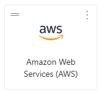
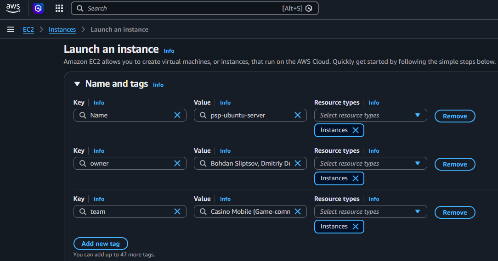
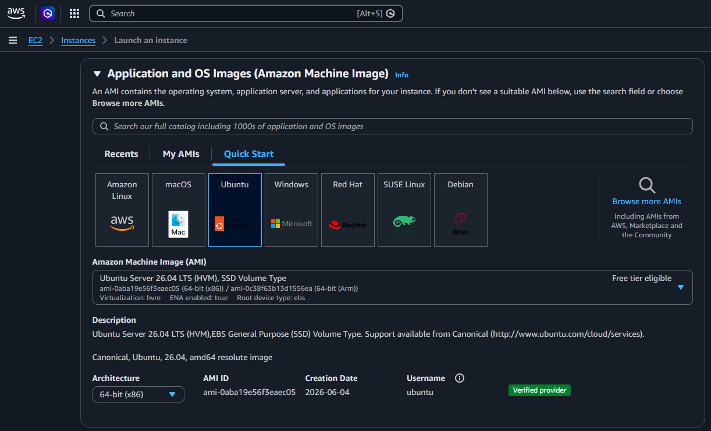
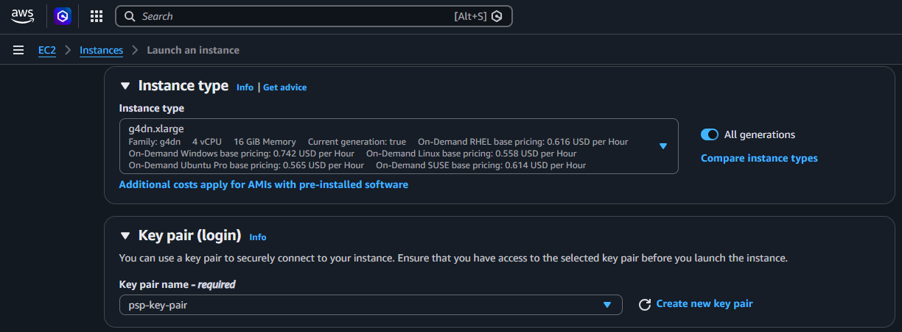
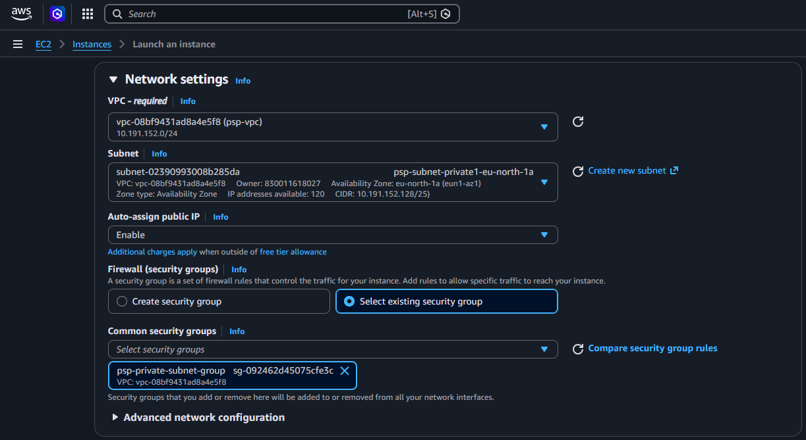
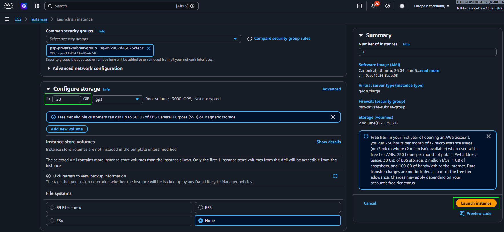
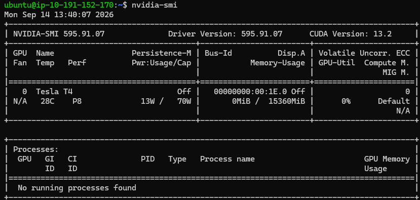

<a name="toc"></a>
# TOC
1. [Build CEF and JCEF for the Linux platform](#build-cef-jcef)
    - [General information (Overview)](#overview)
    - [General Prerequisites](#prerequirements)
    - [Chromium Embedded Framework (CEF) installation and building](#build-cef)
    - [Java Chromium Embedded Framework (JCEF) installation and building](#build-jcef)
2. [PSP application building (on WSL Linux or separate VM)](#psp-build)
3. [Deploying and Running the PSP application (on the AWS Ubuntu instance)](#psp-deploy-run-aws)

<a name="build-cef-jcef"></a>
# Build CEF and JCEF for the Linux platform

<a name="overview"></a>
**General information (Overview):** 
- Windows 11 Enterprise 23H2 with enabled Virtualization will be used as the base OS.
- The Windows Subsystem for Linux version 2 (aka WSL2) will be used for running Linux OS for the build. 

    The Windows Subsystem for Linux (WSL) is a Microsoft feature that lets you run a native GNU/Linux environment, including command-line tools, utilities, and applications directly on Windows without needing a traditional virtual machine or dual-boot setup.
    Key Features:
    - Seamless Integration: Run Linux distributions (like Ubuntu, Debian, or Kali) directly from your Windows desktop.
    - Optimized Performance: Uses a lightweight Hyper-V virtualized environment for the Linux kernel.
    - File Sharing: Easily access your Windows files from within your Linux environment and vice versa.

- The latest Ubuntu 26.04 LTS OS will be used for building CEF and JCEF.

[Back to TOC](#toc)

<a name="prerequirements"></a>
## General Prerequisites
1. **Enable Virtualization and install WSL**

    - UI way: Press Win + R, type `optionalfeatures`, and hit Enter to open the classic "Windows Features" menu. Alternatively, right-click on the Start menu and select Settings. In the left-hand pane of the Settings app, select System. In the right-hand System pane, select Optional features.
    Select **Virtual Machine Platform** and **Windows Subsystem for Linux**, click OK, and reboot OS.
    - Console way: Open PowerShell or Command Prompt as an Administrator and run the single command `wsl --install`. This automated process enables all required Windows features and downloads the default Ubuntu Linux distribution. Reboot the OS.

    **Note:** Virtualization should be enabled in the BIOS settings.
    Without enabling virtualization in your BIOS/UEFI, WSL will fail to start and throw errors like 0x80370102.
    
2. **Install and setup Ubuntu Distribution**

    - Approximately 1.5 Gb free space is necessary on the system drive.

    - Check the list of installed distributions:<br>
    `> wsl --list --all`<br>
    The distribution with the name **Ubuntu** should be absent. If it is present, use another name for further Ubuntu installation.

    - Check the list of the available distributions:<br>
    `> wsl --list --online`<br>
    The **Ubuntu** should be in this list.

    - Install the Ubuntu distribution using the following command:
    `> wsl --install --web-download -d Ubuntu`

    - After installation, Ubuntu asks for a default username and password (twice).
    Enter it and remember.

3. **Move Ubuntu Distribution to the non-system drive** (non-mandatory)

    The Ubuntu system may take a lot of disk space because it will be used for the massive CEF/JCEF build (170-200 Gb). It your system drive does not have enough free space, it is recommended to move the Ubuntu distribution to a non-system drive, for example, to drive D.

    Open PowerShell and execute the following steps in it to move the Ubuntu distribution:

    - Stop WSL:<br>
    `> wsl --shutdown`
    - Create a new folder for temporary backup, for example `D:\WSL\backups\`.
    - Export clear Ubuntu distribution to the archive:
    `> wsl --export Ubuntu D:\WSL\backups\ubuntu.tar`
    - Remove the old registration of the old Ubuntu distribution to remove its files from the system disk C:
    `> wsl --unregister Ubuntu`
    - Create a new folder on the non-system drive where the Ubuntu distribution will be located, for example `D:\WSL\Ubuntu\`.
    - Import the saved Ubuntu distribution to the new working folder:
    `> wsl --import Ubuntu D:\WSL\Ubuntu\ D:\WSL\backups\ubuntu.tar --version 2`
    - It is possible that Ubuntu reset the default user to the **root** user.
    Execute the following command to specify your default user:<br>
    `> ubuntu config --default-user [user]`<br>
    where *[user]* is your default user.
    - Start Ubuntu using the command:<br>
    `> wsl`
    - Check that the Linux user is correct:<br>
    `~$ whoami`<br>
    The output should show your user instead of *root*.
    - Check the Ubuntu version:<br>
    `~$ lsb_release -d`<br>
    Output:
        ```
        Description:    Ubuntu 26.04 LTS
        ```
    - Update and upgrade Ubuntu packages using the following command:<br>
    `~$ sudo apt update && sudo apt upgrade -y`

    **Welcome! Your Ubuntu is ready.**<br>

    *Note:* your home directory in the Ubuntu is **/home/[user]** where *[user]* is your default user. It can be simple opened everywhere using command: `cd ~`.

    *Note:* It is recommended to install **Midnight Commander** (mc) file manager to simply navigate through Linux file system, view/open files, etc; especially if you do not have experience with Unix platforms.<br>
    To install Midnight Commander file manager simple execute the following commands:
    ```
    ~$ sudo apt update
    ~$ sudo apt install mc -y
    ```
    To open Midnight Commander file manager, enter `mc` command from any path.
    

4.  **Troubleshooting**

    - The version of WSL should be 2. <br>
    The version can be checked using the following command:
    `> wsl --status`
    The Default Version in the Console Output should be 2:
        ```
        Default Distribution: Ubuntu
        Default Version: 2
        ```
        Also, the available OS distributions can be verified using the following command:<br>
        `> wsl --list --verbose`<br>
        Output:
        ```
          NAME      STATE           VERSION
        * Ubuntu    Stopped         2
        ```
    - If the WSL version is not 2, then WSL should be updated. The following command should be used to update WSL:<br>
    `> wsl --update`<br> and <br>
    `> wsl --set-default-version 2`
    - WSL may load most of all resources of the Windows OS, especially during downloading and building the CEF/JCEF. <br>
    Building the CEF is highly resource-intensive, requiring at least 16GB of RAM (32GB+ recommended) and 150GB of free disk space. If left WSL unthrottled, the Ninja build system can consume all available system memory and CPU cores, causing system freezing and crashes.<br>
    ✅ Therefore, it is recommended to limit the resources that WSL can use.<br>
    It is possible using `.wslconfig` file located in the home user folder (Windows): `C:\Users\[win_user]\.wslconfig`.<br>
    Add to the `.wslconfig` file following lines to limit the resources that WSL can use:
        ```
        [wsl2]
        memory=24GB
        swap=32GB
        swapfile=D:\\work\\wsl\\wsl-swap.vhdx
        ```
        Where:<br>
        `memory` - maximum RAM that WSL can use;<br>
        `swap` - size of the SWAP file;<br>
        `swapfile` - use a separate SWAP file that is located on the D disk to avoid heavy usage of the Windows SWAP file.
    - WSL cannot work with the Internet/Network in the NAT mode (due to our security limitations or something else). <br>
    Windows 11 introduces a powerful new `Mirrored` networking mode for WSL that forces a Linux virtual machine to use the Windows networking stack directly (as a whole), instead of creating a virtual router.
    Add to the `.wslconfig` file following lines to enable `Mirrored` networking mode:
        ```
        [wsl2]
        networkingMode=Mirrored
        ```
        It allows WSL to work with the Internet/Network without our corporate VPN.<br>

        *Note:* Sometimes, right after installation, WSL cannot work with Network/Internet when our corporate VPN is enabled, probably due to the strictest type of corporate protection — Force Tunneling with blocking Loopback and foreign DNS at the core level of the VPN client.
        Theoretically, it can be bypassed using experimental `VirtioProxy` networking mode. However, it was not verified.<br><br>
        But after some restarts, WSL can connect to the resources under the corporate VPN.<br>
        At least to the Nexus site after installing the PT CA certificate.
    - All the above global settings of WSL can be modified in the UI mode too, using the WSL Settings dialog. To open it, press the Win key, enter `wsl settings` in the search text box, and press Enter.
    - Disconnect (or suspend it) from the corporate VPN before installing applications/programs to the WSL from remote Ubuntu repositories because the corporate VPN blocks connections to them.<br> And, otherwise, connect to the corporate VPN before working with Nexus, SVN, etc.

---
[Back to TOC](#toc)
<br><br>

<a name="build-cef"></a>
## Chromium Embedded Framework (CEF) installation and building
The following official instructions, with necessary modifications, were used for CEF installation and building:
- https://chromiumembedded.github.io/cef/master_build_quick_start
- https://chromiumembedded.github.io/cef/branches_and_building.html
- The Unix path is added for each command in the examples to have understanding where it executes; the direct command is specified after a space.<br>
What it means:<br>
    - `~$ mkdir ~/projects` means that the command `mkdir` is executed in the user's home folder *"/home/[user]"*.
    - `~/projects/cef$ git --version` means that the command `git` is executed in the folder *"/home/[user]/projects/cef"* (the same as *"~/projects/cef"*).

1. Create folders structure for the projects. <br>
I suggest creating a **projects** folder that will contain CEF and JCEF projects using the command:<br> 
    ```
    ~$ mkdir ~/projects
    ```
    Then, the projects for the CEF project can be created using the following commands:
    ```
    ~$ mkdir ~/projects/cef
    ~$ mkdir ~/projects/cef/automate
    ~$ mkdir ~/projects/cef/chromium_git
    ```
    

2. Download and run **"~/code/install-build-deps.py"** to install build dependencies. Answer Y (yes) to all of the questions. <br>
Execute the following commands:
    ```
    cd ~/projects/cef
    
    ~/projects/cef$ sudo apt-get install curl file lsb-release procps python3 python3-pip
    
    ~/projects/cef$ curl 'https://chromium.googlesource.com/chromium/src/+/main/build/install-build-deps.py?format=TEXT' | base64 -d > install-build-deps.py
    
    ~/projects/cef$ sudo python3 ./install-build-deps.py --no-arm --no-chromeos-fonts --no-nacl
    
    ~/projects/cef$ python3 -m pip install dataclasses importlib_metadata
    ```
    *Notes:* 
    - The latest command `python3 -m pip install dataclasses importlib_metadata` from the list above might be failed with *error: externally-managed-environment* message due to the latest PEP 668 security standard is used in the latest Ubuntu. It rejects installing packages using `pip install` globally for the OS to avoid breaking system packages.
    Instead, the system package manager `apt` can be used to install **importlib_metadata**:
        ```
        ~/projects/cef$ sudo apt update
        ~/projects/cef$ sudo apt install python3-importlib-metadata -y
        ```
        Also, the `pip install` command can be executed with the special flag `--break-system-packages` that suppresses the PEP 668 security standard error and installs packages globally:<br>
        `python3 -m pip install importlib_metadata --break-system-packages`<br>
        This way is not recommended.
        Successful installation of **"importlib_metadata"** can be verified using the following command (the *"importlib_metadata is installed"* message should be present in the Bash output if the package is installed):<br>
        ```
        ~/projects/cef$ python3 -c "import importlib_metadata; print('importlib_metadata is installed')"
        ```
    - The installation **"dataclasses"** is not necessary now because this package is included in Python 3.14. Availability of the **"dataclasses"** package can be verified using the following command (the "importlib_metadata is installed" message should be in the Bash output):<br>
        ```
        ~/projects/cef$ python3 -c "import dataclasses; print(dataclasses.__file__)"
        ```
        The *"/usr/lib/python3.14/dataclasses.py"* message should be written in the Bash output if the package is available.

3. Download **"~/projects/cef/depot_tools"** using Git:
    ```
    ~$ cd projects/cef/
    ~/projects/cef$ git clone https://chromium.googlesource.com/chromium/tools/depot_tools.git
    ```
    *Note:* The latest Git is included in the Ubuntu distributive.

4. Add the **"~/projects/cef/depot_tools"** directory to your PATH:
    ```
    ~/projects/cef$ export PATH=/home/[user]/projects/cef/depot_tools:$PATH
    ```
    where *[user]* is your default user.<br>
    Note the use of an absolute path here.

     _**Suggestion:**_ The above export works in the scope of the one WSL session. This means that the above **export** of *depot_tools* to the **PATH** environment variable is temporary and will be lost if the WSL session is reopened or terminated for different reasons and then opened again.<br>
    Therefore, it can be added to the user's **.bashrc** script to avoid losing the *depot_tools* path and avoid further problems with the build.<br>
    It can be done using the following command:<br>
    `~$ echo 'export PATH="$HOME/projects/cef/depot_tools:$PATH"' >> ~/.bashrc`

5. Download the “~/automate/automate-git.py” script using commands:
    ```
    ~/projects/cef$ cd ~/projects/cef/automate
    ~/projects/cef/automate$ wget https://raw.githubusercontent.com/chromiumembedded/cef/master/tools/automate/automate-git.py
    ```
6. Create the **"~/projects/cef/chromium_git/update.sh"** script with the specific content. <br>
The **GNU nano** text editor can be used to create **"update.sh"** script. Execute the following commands to create **"update.sh"** script:
    ```
    ~/projects/cef/automate$ cd ~/projects/cef/chromium_git/
    ~/projects/cef/chromium_git$ nano update.sh
    ```
    The **GNU nano** text editor will be opened.

    According to the CEF documentation, the following content should be added to the **"update.sh"** script:
    ```
    #!/bin/bash
    python3 ../automate/automate-git.py --download-dir=/home/[user]/project/cef/chromium_git --depot-tools-dir=/home/[user]/projects/cef/depot_tools --no-distrib --no-build
    ```
    However, we need to download Chromium sources not from **master** but from a specific **7499** branch that contains **143** version of the Chromium (143.0.14+gdd46a37+chromium-143.0.7499.193).
    Therefore, the following parameter should be added to the script too:<br>
    `--branch=7499`

    Also, ut is recommended to add the following set of specific parameters to the script to increase the possibility of successful execution:<br>
    `--with-pgo-profiles --force-clean --force-config --force-update`

    The final content of the script might/should be following (example):
    ```
    #!/bin/bash
    python3 ../automate/automate-git.py --download-dir=/home/[user]/projects/cef/chromium_git --depot-tools-dir=/home/[user]/projects/cef/depot_tools --no-distrib --no-build --branch=7499 --with-pgo-profiles --force-clean --force-config --force-update
    ```

    Save the content of the **"update.sh"** script by the **GNU nano** editor using following combination:
    - Press Ctrl+O and Enter key to save the script.
    - Press Ctrl+X combination to exit from **GNU nano** text editor.

    The content of the created script can be verified using the **GNU nano** editor or execution the following command:<br>
    `~/projects/cef/chromium_git$ cat update.sh`

7. Prepare **"~/projects/cef/chromium_git/update.sh"** script for execution.<br>
Give it executable permissions using the following command:<br>
`~/projects/cef/chromium_git$ chmod 755 update.sh`

    Check that executable permissions are added:<br>
    `~/projects/cef/chromium_git$ ls -lh update.sh`<br>
    The permissions printed in the Bash console should contain Execute Permission marker with an **x** sign to run the file as a program or script, for example:<br>
    `-rwxr-xr-x 1 [user] [user] 256 Jun 18 16:44 update.sh`

8. Execute the **"update.sh"** script.<br>
`~/projects/cef/chromium_git$ ./update.sh`<br>
Wait for CEF and Chromium source code to download. <br>
The CEF source code will be downloaded to **"~/projects/cef/chromium_git/cef"**. <br>
The Chromium source code will be downloaded to **"~/projects/cef/chromium_git/chromium/src"**. <br>
After the download is complete, the CEF source code will be copied to **"~/projects/cef/chromium_git/chromium/src/cef"**.<br>

    Many errors might occur during this long downloading process.
    If it is something like `git fetch` errors (resources cannot be downloaded and indexes are broken), for example:<br>
    ```
    src/third_party/angle/third_party/glmark2/src (ERROR)
    ...
    Error: Command 'git -c core.deltaBaseCacheLimit=2g fetch origin --no-tags' returned non-zero exit status 128 in /home/[user]/projects/cef/chromium_git/chromium/src/third_party/angle/third_party/glmark2/src
    ```
    then it is recommended to remove the source directory with broken indexes and start the `update.sh` Bash script again:
    ```
    ~/projects/cef/chromium_git$ rm -rf /home/[user]/projects/cef/chromium_git/chromium/src/third_party/glmark2/src
    ~/projects/cef/chromium_git$ ./update.sh
    ```

9. **This step is very important!**<br>
Execute it before each CEF build and check it as described below.<br><br>
Configure `GN_DEFINES` for your desired build environment.<br>
Chromium provides `sysroot` images for consistent builds across Linux distros. The necessary files will have been downloaded automatically as part of step 8 above. **Usage of Chromium’s `sysroot` is recommended** if you don’t want to deal with potential build breakages due to incompatibilities with the package or kernel versions that you’ve installed locally. To use the `sysroot` image, configure the following `GN_DEFINES`:<br>
    ```
    export GN_DEFINES="is_official_build=true use_sysroot=true symbol_level=1 is_cfi=false"
    ```
    ✅ *Note:* The above-specified `GN_DEFINES` for the `sysroot` image was used in the current build process. It is used to build the official build with all necessary libraries and links it correctly (CEF works without `SIGSEGV` memory errors or similar in OSR mode).<br>
    Also, the following `GN_DEFINES` can be specified to make a correct build right for X11 or Wayland Linux Display Servers (graphical subsystem):
    ```
    export GN_DEFINES="is_official_build=true use_ozone=true ozone_platform_x11=true ozone_platform_wayland=true use_sysroot=true is_debug=false symbol_level=1 is_cfi=false"
    ```
    It was checked, and it worked.

    ❌ *Attention!* Do not use specific parameters in a `GN_DEFINES` whose exact purpose you do not know!
    The following parameters might break your CEF build or have unpredictable errors during runtime (for example, memory errors `SIGSEGV` or similar in OSR mode):
    ```
    use_thin_lto
    use_vaapi
    is_component_build
    use_allocator
    use_partition_alloc_as_malloc
    ```
     Specified by export `GN_DEFINES` can be displayed using command: `echo "$GN_DEFINES"`.
    The full list of the arguments (`args.gn`) used for the CEF build can be displayed using the following command:
    ```
    ~$cat ~/projects/cef/chromium_git/chromium/src/out/Release_GN_x64/args.gn
    ```
    Example of output:
    ```
    blink_heap_inside_shared_library=true
    clang_use_chrome_plugins=false
    disable_fieldtrial_testing_config=true
    enable_background_mode=false
    enable_backup_ref_ptr_support=false
    enable_downgrade_processing=false
    enable_linux_installer=false
    enable_resource_allowlist_generation=false
    enable_widevine=true
    forbid_non_component_debug_builds=false
    is_cfi=false
    is_component_build=false
    is_debug=false
    is_official_build=true
    optimize_webui=true
    symbol_level=1
    target_cpu="x64"
    use_partition_alloc_as_malloc=false
    use_qt5=false
    use_qt6=false
    use_sysroot=true
    ```
     **Please check them before each CEF build. It is a very important step; please do it!**<br>
     *Note*: The `cef_create_projects.sh` script merges `GN_DEFINES` into the `args.gn` file that will be used for the next CEF build.

     **It is not verified and is not recommended by me; however, it is present in the official instruction.**<br>
    It is also possible to build using locally installed packages instead of the provided sysroot. Choosing this option may require additional debugging effort on your part to work through any build errors that result. On Ubuntu 18.04, the following `GN_DEFINES` have been tested to work reliably (using the `use_vaapi` parameter might turn off hardware-accelerated video encoding; I do not recommend using it):
    ```
    export GN_DEFINES="use_sysroot=false use_allocator=none symbol_level=1 is_cfi=false use_thin_lto=false use_vaapi=false"
    ```
    *Note:* The `cefclient` target cannot be built directly when using the `sysroot` image. You can work around this limitation by creating a [binary distribution](https://chromiumembedded.github.io/cef/branches_and_building.html#manual-packaging) after completing step 9 below, and then building the `cefclient` target using that binary distribution.<br>
    
    You can also create an [AddressSanitizer build](https://chromiumembedded.github.io/cef/using_address_sanitizer.html) for enhanced debugging capabilities. Just add `is_asan=true dcheck_always_on=true` to the GN_DEFINES listed above and build the `out/Release_GN_x64` directory in step 10 below. Run with the `asan_symbolize.py` script as described in the AddressSanitizer link to get symbolized output.

    The various other listed GN arguments are based on recommendations from the [AutomateBuildSetup page](https://chromiumembedded.github.io/cef/automated_build_setup.html#linux-configuration). You can [search for them by name](https://source.chromium.org/search?q=use_allocator%20gni&ss=chromium) in the Chromium source code to find more details.

10. Run the ``~/code/chromium_git/chromium/src/cef/cef_create_projects.sh`` script to create Ninja project files.<br> 
    ```
    ~/projects/cef/chromium_git$ cd ~/projects/cef/chromium_git/chromium/src/cef
    ~/projects/cef/chromium_git/chromium/src/cef$ ./cef_create_projects.sh
    ```
    Repeat this step if you change the project configuration or add/remove files in the GN configuration (BUILD.gn file).

11. Create a Debug or Release (recommended) build of CEF/Chromium using Ninja.<br>
 Edit the CEF source code at **"~/project/cef/chromium_git/chromium/src/cef"** and repeat this step multiple times to perform incremental builds while developing. <br><br>
 *Note:* The additional `chrome_sandbox` target may be required by step 12. The `cefclient` target will only build successfully if you set `use_sysroot=false` in step 9, so remove that target if necessary.<br><br>
    Example from CEF documentation:
    ```
    ~/projects/cef/chromium_git/chromium/src/cef$ cd ~/projects/cef/chromium_git/chromium/src

    ~/projects/cef/chromium_git/chromium/src$ autoninja -C out/Debug_GN_x64 cefclient cefsimple ceftests chrome_sandbox
    ```
    Replace `Debug` with `Release` to generate a Release build instead of a Debug build.<br><br>
    ✅ Example of usage in the current build (recommended):
    ```
    ~/projects/cef/chromium_git/chromium/src/cef$ cd ~/projects/cef/chromium_git/chromium/src

    ~/projects/cef/chromium_git/chromium/src$ autoninja -C out/Release_GN_x64 cefsimple ceftests -j 8
    ```
    ✅ *Note:* It is recommended to limit the job count to avoid crashes.<br>
    To limit the job count, the `-j [n]` parameter can be added to `ninja/autoninja`. <br>
    Set it to half your available logical cores (e.g., -j 8 or -j 4 depending on your CPU and RAM). In the current build, is used 8 jobs using `-j 8` parameter because the CPU on the physical machine has 16 cores.

    ✅ *Note:* The `chrome_sandbox` target is not necessary for the build because the SUID Sandbox utility is obsolete and is not used by modern Chromium browsers. See the next 12 chapter for detailed information.

12. Set up the Linux SUID sandbox if you are using an older kernel (< 3.8). <br>
❌ **This chapter is not necessary**<br>
The Ubuntu kernel version in WSL 2 is significantly newer. The SUID Sandbox utility was developed by Google over 10 years ago for very old Linux kernels (versions below 3.8) that did not yet know how to safely isolate processes at the user level. The modern Ubuntu 26.04 LTS is used for the CEF build. The kernel version can be checked in WSL with the `uname -r` command - expected output is like 5.15.x or 6.x.x.<br>
Modern Linux kernels have User Namespaces technology built in, which provides security without any old-fashioned SUID helpers. Google itself officially removed support for SUID Sandbox from the Chromium code back in 2016.

13. Run the `cefsimple` and/or `ceftests` sample applications to check the CEF build. <br>
    ```
    ~/projects/cef/chromium_git/chromium/src$ ./out/Release_GN_x64/cefsimple
    ```
    See the [Linux debugging](https://chromium.googlesource.com/chromium/src/+/main/docs/linux/debugging.md) guide for detailed debugging instructions. 
    
    *Note:* The `cefclient` application can be used only if you set `use_sysroot=false` in step 9.
    
14. Apply necessary changes to the CEF sources in the CEF source code folder  **"~/project/cef/chromium_git/chromium/src/cef"**<br>
The changes for CEF are available in the `cef.diff` file (provided by request).
Copy the `cef.diff` file from the Windows file system to the Ubuntu file system.
It can be done using standard Windows Explorer:
    - Press Win + E
    - In the left navigation menu, find Linux (or enter in the address bar `\\wsl$`).
    - Open folder: `Ubuntu -> home -> [user] -> projects -> patches` (create it if it is not present)
    - Copy `cef.diff` into the `patches` folder from Windows (Ctrl+C/Ctrl+V)
Or it can be done via the Linux terminal:
    ```
    ~/projects/cef/chromium_git/chromium/src$ cd ~
    ~$ mkdir /home/[user]/projects/patches
    ~/projects/patches$ cp /mnt/d/work/wsl/patches/cef.diff ~/projects/patches/
    ~/projects/patches$ ls -lh
    ```
    Apply the `cef.diff` file using the following commands:
    ```
    ~/projects/patches$ cd ~/projects/cef/chromium_git/chromium/src/cef
    ~/projects/cef/chromium_git/chromium/src/cef$ git apply ~/projects/patches/cef.diff
    ```
    Check that the changes were applied:<br>
    `git status`<br>
    In the output, you should see a list of files under the heading `Changes not staged for commit` (e.g. `modified: libcef/browser/alloy/alloy_browser_host_impl.cc`). This confirms that the code on disk has been successfully updated to match your modifications file.<br>
    Also, detailed changes can be displayed using the `git diff` command:
    ```
    ~/projects/cef/chromium_git/chromium/src/cef$ git diff
    ```

15. Regenerate Hashes and Rebuild CEF with applied changes.<br>
    After applying the patch, the files on the disk will be updated. Therefore, the CEF should be rebuilt. However, it is not necessary to wait another 4 hours to rebuild CEF again! Thanks to the smart Ninja/Siso system, the next launch will automatically perform an **incremental build**:
    - Execute the generation command to update CEF Hashes for applied changes:
        ```
        ~/projects/cef/chromium_git/chromium/src/cef$ cd ~/projects/cef/chromium_git/chromium/src
        ~/projects/cef/chromium_git/chromium/src$ python3 cef/tools/gclient_hook.py
        ```
    - Rerun the build of CEF again (incremental):
        ```
        ~/projects/cef/chromium_git/chromium/src$ autoninja -C out/Release_GN_x64 cefsimple ceftests -j 8

        ```
        The compiler will quickly run through CEF source files, see that only one or some files from the patch (diff) have changed, recompile only them in 2-3 minutes, and update the final binaries.<br>
    -  This secondary incremental build should be verified because it executes full long build. Need to check `gclient_hook.py` possibilities.
    

16. Rerun the `cefsimple` and/or `ceftests` sample applications to check the modified CEF build. <br>
    ```
    ~/projects/cef/chromium_git/chromium/src$ ./out/Release_GN_x64/cefsimple
    ```
    The CEF Simple application should be opened:
    


17. Make CEF binary distribution package.<br>
After building Debug and/or Release configurations, it is necessary to create a binary distribution package using the `make_distrib` tool.<br>
To create a binary distribution package, open the `tools` folder and run the `make_distrib.sh` script as displayed below:
    ```
    ~/projects/cef/chromium_git/chromium/src$ cd ~/projects/cef/chromium_git/chromium/src/cef/tools/
    ~/projects/cef/chromium_git/chromium/src/cef/tools$ ./make_distrib.sh --ninja-build --minimal --x64-build
    ```
    If the process succeeds, a binary distribution package will be created in the `~/projects/cef/chromium_git/chromium/src/cef/binary_distrib` directory:
    ```
    ~/projects/cef/chromium_git/chromium/src/cef/binary_distrib$ ls -lh
    total 692M
    drwxr-xr-x 8 4.0K Jun 23 06:28 cef_binary_143.0.14+gdd46a37+chromium-143.0.7499.193_linux64_minimal
    -rw-r--r-- 1 692M Jun 23 06:29 cef_binary_143.0.14+gdd46a37+chromium-143.0.7499.193_linux64_minimal.zip
    ```

    See the `make_distrib.py` script for additional usage options (if necessary). <br>

    The resulting binary distribution will be used by the PSP application.

18. Optimize the size of the CEF binary distribution package (libcef.so)<br>
    It is necessary to check the size of the `libcef.so` library after building.<br>
    Even if the build was made in the `release` profile, the `libcef.so` library might have a lot of debugging information and have a very large size. For example, after the build described in the current instruction, the `libcef.so` library has 2.5 Gb size (due to Google scripts mostly ignoring the `release` profile and adding debugging info and symbols to the library). And it is inappropriate. Maven cannot pack files larger than 2 GB into the JAR.<br>
    The `strip` native Linux command can help to remove unnecessary debugging information and symbols.<br>
    Execute the following commands to reduce the size of the `libcef.so` library (if it is necessary):
    ```
    ~/projects/cef/chromium_git/chromium/src/cef/binary_distrib$ cd cef_binary_143.0.14+gdd46a37+chromium-143.0.7499.193_linux64_minimal/Release/

    ~/projects/cef/chromium_git/chromium/src/cef/binary_distrib/cef_binary_143.0.14+gdd46a37+chromium-143.0.7499.193_linux64_minimal/Release$ strip --strip-all libcef.so
    ```
    After executing the above commands, the debugging information will be removed from the `libcef.so` library, and its size will be normal (~400 Mb).<br>
    Also, other native libraries might be optimized. To optimize all native libraries, the following commands should be executed:
    ```
    ~/projects/cef/chromium_git/chromium/src/cef/binary_distrib/cef_binary_143.0.14+gdd46a37+chromium-143.0.7499.193_linux64_minimal/Release$ strip --strip-all *.so

    ~/projects/cef/chromium_git/chromium/src/cef/binary_distrib/cef_binary_143.0.14+gdd46a37+chromium-143.0.7499.193_linux64_minimal/Release$ strip --strip-all *.so.1

    ~/projects/cef/chromium_git/chromium/src/cef/binary_distrib/cef_binary_143.0.14+gdd46a37+chromium-143.0.7499.193_linux64_minimal/Release$ strip --strip-all chrome-sandbox
    ```
    This operation reduces the overall size of the CEF native libraries for future use as a release. It made the size of the CEF native libraries less than 35.8% in my example.<br>

     *Note*: It is necessary to check that the CEF native libraries are working as expected because sometimes the `strip` command might break some necessary features/memory allocation tables by removing symbols that it marks as debugging. Check it at least using `cefsimple` or `ceftests`.

---
[Back to TOC](#toc)
<br><br>

<a name="build-jcef"></a>
## Java Chromium Embedded Framework (JCEF) installation and building
The following information and official instruction with necessary modifications, were used for JCEF installation and building:
- https://github.com/chromiumembedded/java-cef
- https://chromiumembedded.github.io/java-cef/branches_and_building
- The Unix path is added for each command in the examples to have understanding where it executes; the direct command is specified after the space.<br>
What it means:<br>
    - `~$ mkdir ~/projects` means that the command `mkdir` is executed in the user's home folder *"/home/[user]"*.
    - `~/projects/jcef$ git --version` means that the command `git` is executed in the folder *"/home/[user]/projects/jcef"* (the same as *"~/projects/jcef"*).

0. Prerequisites < br>
    To build JCEF from source code, you should begin by installing the build prerequisites for your operating system and development environment.<br> 
    
    **For all platforms, this includes:**
    - CMake version 3.21 or newer.
    - Git.
    - Java version 7 to 14 (**Java 21** will be used in this instruction).
    - Python version 2.6+ or 3+ (**Python 3.12** will be used in this instruction instead of the included in the Ubuntu Python 3.14 due to incompatibility problems with the JCEF build).
    <br>

    **For Linux platforms:**<br>
    Currently supported distributions include Debian 10 (Buster), Ubuntu 18 (Bionic Beaver), and related. <br>
    Ubuntu 18.04 64-bit with GCC 7.5.0+ is recommended. Newer versions will likely also work but may not have been tested. <br>
    The **Ubuntu 26.04 LTS** will be used in this instruction.
    
    Required packages include: 
    - build-essential
    - libgtk-3-dev<br><br>

    **Installing required components**<br>
    - Install **CMake**:<br>
        Execute the following commands:
        ```
        ~$ sudo apt update
        ~$ sudo apt install cmake -y
        ```
        Check that CMake was installed successfully:<br>
        `~$ cmake --version`<br>
        Output should be like following:<br>
        `cmake version 4.2.3`

    - **Git** is included in Ubuntu 26.04, it is not necessary to install it. It can be verified using the command: `~$ git version`. The output should be: `git version 2.53.0`.
    - Install **Java 21**:<br>
        Install Java 21 JDK:
        ```
        ~$ sudo apt update
        ~$ sudo apt install openjdk-21-jdk -y
        ~$ java -version
        ```
        The output should be as follows:
        ```
        openjdk version "21.0.11" 2026-04-21
        OpenJDK Runtime Environment (build 21.0.11+10-1-26.04.2-Ubuntu)
        OpenJDK 64-Bit Server VM (build 21.0.11+10-1-26.04.2-Ubuntu, mixed mode, sharing)
        ```
        Setup a `JAVA_HOME` variable. Add the `JAVA_HOME` variable to the `.bashrc` script:<br>
        ```
        ~$ echo 'export JAVA_HOME="/usr/lib/jvm/java-21-openjdk-amd64"' >> ~/.bashrc
        ```
        Update the current terminal session settings immediately:<br>
        `~$ source ~/.bashrc`<br>
        Check `JAVA_HOME` variable:<br>
        `~$ echo $JAVA_HOME`<br>
        The output should be:<br>
        `/usr/lib/jvm/java-21-openjdk-amd64`<br>

    - Install **Python 3.12**:
    Enable `Deadsnakes PPA` repository to install unactual old packages:
        ```
        ~$ sudo apt update
        ~$ sudo apt install software-properties-common -y
        ~$ sudo add-apt-repository ppa:deadsnakes/ppa -y
        ```
        Install Python 3.12 and development tools:
        ```
        ~$ sudo apt update
        ~$ sudo apt install python3.12 python3.12-dev python3.12-venv -y
        ```
        Check that Python 3.12 was installed:<br>
        `~$ python3.12 --version`<br>
        Output should be following:<br>
        `Python 3.12.13`<br>
        Set specific `` environment variable to the `.bashrc` script:
        ```
        ~$ echo 'export CLOUDSDK_PYTHON="/usr/bin/python3.12"' >> ~/.bashrc
        ~$ source ~/.bashrc
        ```

    
    - The `build-essential` is included in Ubuntu 26.04, it is not necessary to install it. It can be verified using the command: `~$ dpkg -l build-essential`. The output should be as follows:
        ```
        ||| Name            Version      Architecture Description
        +++-===============-============-============-==============================================
        ii  build-essential 12.12ubuntu2 amd64        Informational list of build-essential packages
        ```
    - The `libgtk-3-dev` is included in Ubuntu 26.04, it is not necessary to install it. It can be verified using the command: `~$ dpkg -l libgtk-3-dev`. The output should be as follows:
        ```
        ||| Name               Version          Architecture Description
        +++-==================-================-============-=====================================
        ii  libgtk-3-dev:amd64 3.24.52-0ubuntu1 amd64        development files for the GTK library
        ```


1. Downloading JCEF Source Code
Create a new folder under `projects` for the JCEF project:
    ```
    ~$ mkdir ~/projects/jcef
    ```
    Download the latest JCEF source code using Git:
    ```
    ~$ git clone https://github.com/chromiumembedded/java-cef.git ~/projects/jcef
    ```
    Checkout specific version of the JCEF code (that uses 143 Chromium, as CEF uses) from commit `cffac27`:
    ```
    ~$ cd projects/jcef/
    ~/projects/jcef$ git checkout cffac27
    ```
    Check the `CMakeLists.txt` file in the `jcef` folder, the `CEF_VERSION` should be `143.0.14+gdd46a37+chromium-143.0.7499.193` (the same as in the CEF from previous chapter).

2. Apply the necessary Java JCEF sources in the JCEF source code folder  **"~/project/jcef/java"**<br>
The changes for the CEF are available in the `jcef.diff` file (provided by request).
Copy `jcef.diff` file from Windows file system to the Ubuntu file system.
It can be done using standard Windows Explorer:
    - Press Win + E
    - In the left navigation menu, find Linux (or enter in the address bar `\\wsl$`).
    - Open folder: `Ubuntu -> home -> [user] -> projects -> patches` (create it if it is not present)
    - Copy `jcef.diff` into the `patches` folder from Windows (Ctrl+C/Ctrl+V)<br>

    Or it can be done via the Linux terminal:<br>
    ```
    ~/projects/patches$ cp /mnt/d/work/wsl/patches/jcef.diff ~/projects/patches/
    ~/projects/patches$ ls -lh
    ```
    Apply the `jcef.diff` file using the following commands (the latest command is necessary to emulate adding a new files as not staged instead of untracked):
    ```
    ~/projects/patches$ cd ~/projects/jcef/
    ~/projects/jcef$ git apply ~/projects/patches/jcef.diff
    ~/projects/jcef$ git add -N .
    ```
    Check that the changes were applied:<br>
    `git status`<br>
    In the output, you should see a list of files under the heading `Changes not staged for commit`, for example:
    ```
    HEAD detached at cffac27
    Changes not staged for commit:
    (use "git add <file>..." to update what will be committed)
    (use "git restore <file>..." to discard changes in working directory)
            modified:   java/org/cef/CefApp.java
            modified:   java/org/cef/CefClient.java
            new file:   java/org/cef/DefaultLoader.java
            modified:   java/org/cef/SystemBootstrap.java
            modified:   java/org/cef/browser/CefBrowser.java
            modified:   java/org/cef/browser/CefBrowserFactory.java
            new file:   java/org/cef/browser/CefBrowserOsrMin.java
            new file:   java/org/cef/handler/CefAudioHandler.java
            new file:   java/org/cef/handler/CefAudioHandlerAdapter.java
            modified:   java/org/cef/handler/CefClientHandler.java
            modified:   java/org/cef/handler/CefDisplayHandler.java
            modified:   java/org/cef/handler/CefDisplayHandlerAdapter.java
            modified:   java/org/cef/handler/CefRenderHandlerAdapter.java
            new file:   java/org/cef/misc/CefAudioParameters.java
            new file:   java/org/cef/misc/CefChannelLayout.java
            modified:   native/CMakeLists.txt
            modified:   native/CefClientHandler.cpp
            modified:   native/CefClientHandler.h
            new file:   native/audio_handler.cpp
            new file:   native/audio_handler.h
            modified:   native/client_handler.cpp
            modified:   native/client_handler.h
            modified:   native/display_handler.cpp
            modified:   native/display_handler.h

    no changes added to commit (use "git add" and/or "git commit -a")
    ```    
    
    This confirms that the code on disk has been successfully updated to match modifications files.

3. Generate project files for Linux platform.
Run CMake to generate Linux project files and then build the resulting native targets. See CMake output for any additional steps that may be necessary. For example, to generate a Release build of the `jcef` and `jcef_helper` targets:
    ```
    ~$ cd ~/projects/jcef
    ~/projects/jcef$ mkdir jcef_build && cd jcef_build
    ~/projects/jcef$ cmake -G "Unix Makefiles" -DCMAKE_BUILD_TYPE=Release ..
    ```
    If the project files are generated successfully, the following output should be displayed in the Terminal Console:
    ```
    -- Configuring done (13.3s)
    -- Generating done (0.1s)
    -- Build files have been written to: /home/[user]/projects/jcef/jcef_build
    ```
    If project generation fails, the errors should be fixed.<br>

     Troubleshooting of project files generation:
    - Error: `ModuleNotFoundError: No module named 'six.moves'`<br>
    Check the Python version used for generation. It is displayed in the output of the generator: `-- Found PythonInterp: /usr/bin/python3 (found version "3.12.13")`. <br>
    If in the generator is used 3.14 version, it can be specified manually using the following command:
        ```
        ~/projects/jcef/jcef_build$ cmake -G "Unix Makefiles" -DCMAKE_BUILD_TYPE=Release -DPYTHON_EXECUTABLE=/usr/bin/python3.12 ..
        ```
        If it also does not help (the generator uses Python 3.12 but internal `gsutil` might use the system-preferred Python 3.14):<br>
        Mark Python 3.12 as the system-preferred version. To do it, please use the following commands:
        ```
        ~/projects/jcef/jcef_build$ sudo update-alternatives --install /usr/bin/python3 python3 /usr/bin/python3.14 1
        ~/projects/jcef/jcef_build$ sudo update-alternatives --install /usr/bin/python3 python3 /usr/bin/python3.12 2
        ```
        Check the system default Python version:<br>
        `~/projects/jcef/jcef_build$ python3 --version`<br>
        Output should be:<br>
        `Python 3.12.13`<br>
        Run the generator again:
        ```
        ~/projects/jcef/jcef_build$ rm -rf *
        ~/projects/jcef/jcef_build$ cmake -G "Unix Makefiles" -DCMAKE_BUILD_TYPE=Release ..
        ```
        If the problem still occurs (the `ModuleNotFoundError: No module named 'six.moves'` error is still displayed), it can be an internal-specific bug of the `gsutil` Google library. In this case, it is possible to use the following hack: add the correct system `six` module directly to `gsutil`.<br>
        Find the broken `six` module:<br>
        ```
        ~/projects/jcef/jcef_build$ cd /home/[user]/projects/jcef/tools/buildtools/external_bin/gsutil/gsutil_4.68/gsutil/third_party
        ```
        Change the broken `six` module to the system `six` module using the following commands (if the system `six` folder is present in `/usr/lib/python3/dist-packages/`):
        ```
        ~/projects/jcef/tools/buildtools/external_bin/gsutil/gsutil_4.68/gsutil/third_party$ mv six six_old_broken
        ~/projects/jcef/tools/buildtools/external_bin/gsutil/gsutil_4.68/gsutil/third_party$ ln -s /usr/lib/python3/dist-packages/six six
        ```
        If the `six` folder is not present in `/usr/lib/python3/dist-packages/`:<br>
        find the system `six` module location in the Linux OS:<br>
        ```
        ~/projects/jcef/tools/buildtools/external_bin/gsutil/gsutil_4.68/gsutil/third_party$ python3.12 -c "import six; print(six.__file__)"
        ```
        Output should be like following:
        ```
        /home/[user]/projects/jcef/tools/buildtools/external_bin/gsutil/gsutil_4.68/gsutil/third_party/six/__init__.py
        ```
        In this case, execute next commands:
        ```
        ~/projects/jcef/tools/buildtools/external_bin/gsutil/gsutil_4.68/gsutil/third_party$ mkdir -p six
        ~/projects/jcef/tools/buildtools/external_bin/gsutil/gsutil_4.68/gsutil/third_party$ ln -sf /usr/lib/python3/dist-packages/six.py six/__init__.py
        ```
        This hack needed to see the Google's `gsutil` to use system `six` module.<br>
        Run the generator again:
        ```
        ~/projects/jcef/tools/buildtools/external_bin/gsutil/gsutil_4.68/gsutil/third_party$ cd ~/projects/jcef/jcef_build/
        ~/projects/jcef/jcef_build$ rm -rf *
        ~/projects/jcef/jcef_build$ cmake -G "Unix Makefiles" -DCMAKE_BUILD_TYPE=Release ..
        ```
    - Error: `ModuleNotFoundError: No module named 'boto.vendored.six.moves'`<br>
        In this case, it is a similar problem in the internal subsystem `boto` (library for Amazon/Google cloud, which `gsutil` uses). It also tries to import `six.moves` from own old developer folders `boto.vendored.six.moves`, and cannot do it because rules of the packages downloading are updated in the new Python versions.<br>
        Do the next steps in the Ubuntu terminal:<br>
        ```
        ~/projects/jcef/jcef_build$ cd /home/[user]/projects/jcef/tools/buildtools/external_bin/gsutil/gsutil_4.68/gsutil/gslib/vendored/boto/boto/vendored
        ```
        If the `six` folder exists, rename it:
        ```
        ~/projects/jcef/tools/buildtools/external_bin/gsutil/gsutil_4.68/gsutil/gslib/vendored/boto/boto/vendored$ mv six six_old_broken
        ```
        Then, create a new empty `six` folder and link it to the system working `six` module:
        ```
        ~/projects/jcef/tools/buildtools/external_bin/gsutil/gsutil_4.68/gsutil/gslib/vendored/boto/boto/vendored$ mkdir -p six

        ~/projects/jcef/tools/buildtools/external_bin/gsutil/gsutil_4.68/gsutil/gslib/vendored/boto/boto/vendored$ln -sf /usr/lib/python3/dist-packages/six.py six/__init__.py
        ```
        Run generator again:
        ```
        ~/projects/jcef/tools/buildtools/external_bin/gsutil/gsutil_4.68/gsutil/gslib/vendored/boto/boto/vendored$ cd ~/projects/jcef/jcef_build/
        ~/projects/jcef/jcef_build$ rm -rf *
        ~/projects/jcef/jcef_build$ cmake -G "Unix Makefiles" -DCMAKE_BUILD_TYPE=Release ..
        ```
    - Error: `ModuleNotFoundError: No module named 'imp'`<br>
        It is a classic conflict between the old `gsutil` and new Python versions.<br>
        The `imp` module was removed from Python 3.12 core and later versions. The `importlib` module should be used instead `imp`. However, it is very difficult to replace `imp` with the `importlib` module everywhere in the build scripts (the usage is also different).<br>
        To fix this problem, the `imp` module can be installed to the Python 3.12:
        ```
        ~/projects/jcef/jcef_build$ python3.12 -m pip install imp --break-system-packages
        ```
        If the `imp` module cannot be found in the `PyPI` (pip) repository, the following hack can be done. Execute the following command to create a dummy replacement for the `imp` module (attention: it is one command!):
        ```
        ~/projects/jcef/jcef_build$ sudo tee /usr/lib/python3/dist-packages/imp.py << 'EOF'
        from importlib.machinery import SourceFileLoader
        import warnings
        warnings.warn("The imp module is deprecated", DeprecationWarning, stacklevel=2)

        def load_source(name, pathname, file=None):
            return SourceFileLoader(name, pathname).load_module()
        EOF
        ```
        Check that the `imp` module is available:
        ```
        ~/projects/jcef/jcef_build$ python3.12 -c "import imp; print('imp module found')"
        ```
        Output should be:
        ```
        <string>:1: DeprecationWarning: The imp module is deprecated
        imp module found
        ```
        Run generator again:
        ```
        ~/projects/jcef/jcef_build$ rm -rf *
        ~/projects/jcef/jcef_build$ cmake -G "Unix Makefiles" -DCMAKE_BUILD_TYPE=Release ..
        ```
    - These are the most common errors. Other errors might also occur, and ways to solve them can be found using Google search or AI.

4. Build using Make. <br>
Execute the following command (run Make build limited to 8 running jobs/threads):
    ```
    ~/projects/jcef/jcef_build$ make -j8
    ```
    Wait until the build is finished without any errors:
    ```
    [100%] Built target jcef
    ```

     **Troubleshooting of Build using Make**:
    - Error: `audio_handler.cpp:6:10: fatal error: direct.h: No such file or directory`<br>
    The `direct.h` is for Windows OS only.
    To fix it open `audio_handler.cpp` file using **GNU nano** editor:
        ```
        ~/projects/jcef/jcef_build$ cd ~/projects/jcef/native/
        ~/projects/jcef/native$ nano audio_handler.cpp
        ```
        Modify line `#include <direct.h>` as displayed below:
        ```
            #if defined(OS_WIN)
                #include <direct.h>
            #else
                #include <unistd.h>
                #include <sys/stat.h>
            #endif
        ```
        After modification, save changes:
        - Press Ctrl+O combination and Enter key to save script.
        - Press Ctrl+X combination to exit from **GNU nano** text editor.<br>

        Run Build again:
        ```
        ~/projects/jcef/native$ cd ~/projects/jcef/jcef_build/
        ~/projects/jcef/jcef_build$ make -j8
        ``` 
    - Errors: <br>
    `audio_handler.cpp:141:23: error: ‘MAX_PATH’ was not declared in this scope`<br>
    `audio_handler.cpp:142:32: error: ‘cCurrentPath’ was not declared in this scope`<br>
    `audio_handler.cpp:142:24: error: ‘_getcwd’ was not declared in this scope; did you mean ‘getcwd’?`<br>
    To fix them open `audio_handler.cpp` file using **GNU nano** editor:
        ```
        ~/projects/jcef/jcef_build$ cd ~/projects/jcef/native/
        ~/projects/jcef/native$ nano audio_handler.cpp
        ```
        Modify line previously modified `#if defined(OS_WIN)` block as displayed below:
        ```
            #if defined(OS_WIN)
                include <direct.h>
            #else
                #include <unistd.h>
                #include <sys/stat.h>
                #include <limits.h>

                #define MAX_PATH PATH_MAX
                #define _getcwd getcwd
            #endif
        ```
        After modification, save changes:
        - Press Ctrl+O combination and Enter key to save script.
        - Press Ctrl+X combination to exit from **GNU nano** text editor.<br>
        This modification should fix the above-mentioned errors.
        Run Build again:
        ```
        ~/projects/jcef/native$ cd ~/projects/jcef/jcef_build/
        ~/projects/jcef/jcef_build$ make -j8
        ``` 

5. Build the JCEF Java classes using the `compile.sh` Bash script.<br>
Execute the following commands:
    ```
    ~/projects/jcef/jcef_build$ cd ~/projects/jcef/tools/
    ~/projects/jcef/tools$ ./compile.sh linux64 Release
    ```
    Fix compilation errors if they are present.<br>
    **If there are no errors, try to do next step (step 6: run JCEF test application)**.

     Troubleshooting of building JCEF Java classes:
    - Error:
        ```
        /home/[user]/projects/jcef/java/org/cef/handler/CefDisplayHandler.java:36: error: cannot find symbol
        public void onFaviconURLChange(CefBrowser browser, Vector<String> iconsUrls);
                                                        ^
        symbol:   class Vector
        location: interface CefDisplayHandler

        /home/[user]/projects/jcef/java/org/cef/handler/CefDisplayHandlerAdapter.java:28: error: cannot find symbol
            public void onFaviconURLChange(CefBrowser browser, Vector<String> iconsUrls) {
                                                            ^
        symbol:   class Vector
        location: class CefDisplayHandlerAdapter
        ```
        Potentially, the import of the Vector class is not found.<br>
        It should be added. Add `import java.util.Vector;` to the all classes where it is used using `nano` editor, for example:
        ```
        ~/projects/jcef/tools$ nano ~/projects/jcef/java/org/cef/handler/CefDisplayHandler.java
        ```
        The **GNU nano** editor will be opened.<br>
        After adding `import java.util.Vector;` save changes:
        - Press Ctrl+O combination and Enter key to save the script.
        - Press Ctrl+X combination to exit from **GNU nano** text editor.<br>

        Repeat it for all Java files where the same error are occurred.`

    The full list of the changes in the JCEF project for Linux can be displayed using the following command:
    ```
    ~/projects/jcef/tools$ cd ~/projects/jcef
    ~/projects/jcef$ git diff
    ```
    Also, it can be saved to the `jcef-linux.diff` file using the following command:
    ```
    ~/projects/jcef$ git diff > jcef-linux.diff
    ```
    The `jcef-linux.diff` file can be provided upon request.

6.  On Linux, test that the resulting build works using the `run.sh` Bash script. <br>
    It is possible either run the simple example (see java/simple/MainFrame.java) or the detailed one (see java/detailed/MainFrame.java) by appending `detailed` or `simple` to the `run.sh` script. This example assumes that the `Release` configuration was built in step 5 and that you want to use the detailed example.<br>
    Execute the following command:
    ```
    ~/projects/jcef/tools$ ./run.sh linux64 Release detailed
    ```
    The JCEF browser window will be opened:
    

7. Make JCEF binary distribution package.
    After building and compiling JCEF, it is necessary to create a binary distribution package using the `make_distrib` tool.<br>
    To create a binary distribution package, open the `tools` folder and run the `make_distrib.sh` script as displayed below:
    ```
    ~/projects/jcef/tools$ ./make_distrib.sh linux64
    ```
    As a result, the `~/projects/jcef/binary_distrib/linux64/` folder will be created.<br>
    This folder contains all executables and libraries that are necessary for JCEF/CEF.<br>
    Content:<br>
    - `/binary_distrib/linux64/` - contains `run.sh` and `compile.sh` Bash scripts;
    - `/binary_distrib/linux64/bin/` - contains JAR files of the Java JCEF library;
    - `/binary_distrib/linux64/bin/lib/linux64/` - contains CEF, JCEF and other native libraries;
    - `/binary_distrib/linux64/bin/tests/` - contains JCEF test classes;
    - `/binary_distrib/linux64/docs/` - generated JCEF documentation.

8.  Copy modified CEF binary distributive libraries to the JCEF binary distributive.<br>
    To do it the following commands should be executed:
    - Create two new environment variables to simplify the process:
    ```
    ~$ export MY_CEF="/home/[user]/projects/cef/chromium_git/chromium/src/cef/binary_distrib/cef_binary_143.0.14+gdd46a37+chromium-143.0.7499.193_linux64_minimal"
    ~$ export JCEF_BIN="/home/[user]/projects/jcef/binary_distrib/linux64/bin/lib/linux64"
    ```
    The environment variables can be verified using the `echo` command, for example:<br>
    `~$ echo $MY_CEF`
    - Copy CEF binary distributive libraries:
        ```
        ~$ cp -f $MY_CEF/Release/* $JCEF_BIN/
        ```
        The following files will be copied:
        ```
        chrome-sandbox
        libEGL.so
        libGLESv2.so
        libcef.so
        libvk_swiftshader.so
        libvulkan.so.1
        v8_context_snapshot.bin
        vk_swiftshader_icd.json
        ```
    - Copy CEF resources (localized files):
        ```
        ~$ cp -fr $MY_CEF/Resources/* $JCEF_BIN/
        ```
        The following files and one folder will be copied:
        ```
        /locales
        chrome_100_percent.pak
        chrome_200_percent.pak
        icudtl.dat
        resources.pak
        ```
9. Optimize the size of the JCEF binary distribution package.<br>
    It is better to optimize the JCEF native libraries too.
    The following command should be executed to optimize the JCEF native libraries:
    ```
    ~$ cd ~/projects/jcef/binary_distrib/linux64/bin/lib/linux64
    ~/projects/jcef/binary_distrib/linux64/bin/lib/linux64$ strip --strip-all jcef_helper
    ~/projects/jcef/binary_distrib/linux64/bin/lib/linux64$ strip --strip-all libjcef.so
    ```
    After optimization, the native libraries (CEF and JCEF) should have a size less than 500MB:
    ```
    ~/projects/jcef/binary_distrib/linux64/bin/lib/linux64$ ls -lh
    total 448M
    ```

10. Check that the resulting modified JCEF build with modified CEF binaries works using the `run.sh` Bash script. <br>
Details can be found in `Step 6` but the `run.sh` Bash script should be executed from the JCEF `binary_distrib` folder that was created in Step 7.<br>

---
[Back to TOC](#toc)
<br><br>

<a name="psp-build"></a>
# PSP application building (on the WSL Linux or separate VM)
To build the PSP application from source code, you should begin by installing the build tools and application server for the Linux operating system.<br> 
    
**It is necessary to install:**
- Java version **21**
- Apache `Maven` build tool for Java projects (recommended: a separate installation for Linux)
- Apache `Tomcat 11` (if the Tomcat service will be used instead of the Embedded Tomcat package included in the PS application)
<br>

**Installing required components**<br>
- Install **Java 21**:<br>
    The **Java 21** should already be installed during the JCEF building, see `0. Pre-requirements` section in the previous chapter.<br><br>
- Install **Apache `Maven` build tool** (if it is necessary):<br>
    First of all, check if Maven from your Windows OS is available in the WSL system using the command:
    ```
    ~$ mvn -version
    ```
    If the output looks like the following, the Maven build tool from Windows OS is available and accessible for WSL VM host:
    ```
    Apache Maven 3.6.3 (cecedd343002696d0abb50b32b541b8a6ba2883f)
    Maven home: /mnt/d/work/maven
    Java version: 21.0.11, vendor: Ubuntu, runtime: /usr/lib/jvm/java-21-openjdk-amd64
    Default locale: en, platform encoding: UTF-8
    OS name: "linux", version: "6.18.33.2-microsoft-standard-wsl2", arch: "amd64", family: "unix"
    ```
    In this case, the Maven installation from Windows OS is accessible and might be used for building the PSP application (see the `Maven home: /mnt/d/work/maven` line).<br> <br>
     The way Ubuntu sees the Maven installation from Windows is a classic and very handy feature of WSL2. It's called Mnt (Mount) Interoperability. When WSL starts, it automatically adds all system paths from your Windows to the global Linux command search variable ($PATH), including the C: and D: drive folders (/mnt/c/Users/.../maven/bin) [results=["0"]]. When you type `mvn`, Linux simply takes and calls the Windows binary through this layer.<br>
    **However, for compiling complex projects (especially with native dependencies on Linux), it is highly undesirable to use the Windows version of Maven, as this can lead to path conflicts.**<br><br>

    ✅ Therefore, **it is recommended to use a separate Maven installation in Ubuntu OS for building applications for Linux**; this is the only technically correct way for a developer. When you install the standalone Linux version of Maven, Linux will start using it, completely ignoring the Windows version.

    Execute the following command to install a separate clean Maven installation on the WSL VM host (Linux):
    ```
    ~$ sudo apt update && sudo apt install maven -y
    ```
    
    Check that a separate clean Maven is installed successfully on the WSL VM host (Linux):
    ```
    ~$ mvn --version
    ```
    If the output still contains `Maven home: /mnt/d/work/maven` line, it means, that the Maven from Windows OS is still is used by WSL.<br>
    In this case, it is necessary to explicitly specify the path to the Maven build tool in WSL. Execute the following commands to do it:
    ```
    ~$ echo 'export PATH="/usr/share/maven/bin:$PATH"' >> ~/.bashrc
    ~$ source ~/.bashrc
    ```
    Check again that a separate clean Maven is installed successfully on the WSL VM host (Linux):
    ```
    ~$ mvn --version 
    ```
    The output should not (!) contain `Maven home: /mnt/d/work/maven` line and should be like following:
    ```
    Apache Maven 3.9.12
    Maven home: /usr/share/maven
    Java version: 21.0.11, vendor: Ubuntu, runtime: /usr/lib/jvm/java-21-openjdk-amd64
    Default locale: en, platform encoding: UTF-8
    OS name: "linux", version: "6.18.33.2-microsoft-standard-wsl2", arch: "amd64", family: "unix"
    ```
    The `Maven home: /usr/share/maven` line shows that a separate clean Maven installation is used by the WSL VM host.<br><br>
    However, this clear Maven installation should be configured to build the PSP application.
    <br>

    Now it is necessary to copy Maven's `settings.xml` configuration file from the Windows host to the WSL Linux VM host.<br>
    Do the following steps to copy the `settings.xml` file:
    - Create hidden `.m2` directory under the Home directory (usual location):
        ```
        ~$ mkdir -p ~/.m2
        ```
    - Copy Maven's `settings.xml` configuration file from the Windows host to the WSL Linux VM host using the following command:
        ```
        ~$ cp /mnt/[path-to Windows-settings.xml] ~/.m2/
        ```
        where `[path-to Windows-settings.xml]` is the absolute path to the `settings.xml` configuration file on the Windows host.
        Example of the command:
        ```
        ~$ cp /mnt/d/work/maven/conf/settings.xml ~/.m2/
        ```
        Check copied `settings.xml` file using `Nano` editor:
        ```
        ~$ nano ~/.m2/settings.xml
        ```
        If the `settings.xml` file contains Windows paths, replace them to the Linux paths.
        <br><br>
         **Connect corporate VPN before checking!**<br>
        Check that Maven uses the copied configuration and has a connection to the Nexus site using the command:
        ```
        ~$ mvn help:evaluate -Dexpression=settings.localRepository
        ```
        The build should finish successfully:
        ```
        [INFO]
        /home/[user]/.m2/repository
        [INFO] ------------------------------------------------------------------------
        [INFO] BUILD SUCCESS
        [INFO] ------------------------------------------------------------------------
        [INFO] Total time:  1.422 s
        [INFO] Finished at: 2026-07-16T14:31:57+03:00
        [INFO] ------------------------------------------------------------------------
        ```

        
        Also, check the Bash console for many warnings like the following:
        ```
        [WARNING] org.apache.maven.plugins/maven-metadata.xml failed to transfer from https://ua-mobile-nexus-ngm.pt.playtech.corp/repository/releases/ during a previous attempt. This failure was cached in the local repository and resolution will not be reattempted until the update interval of ngm-releases has elapsed or updates are forced. Original error: Could not transfer metadata org.apache.maven.plugins/maven-metadata.xml from/to ngm-releases (https://ua-mobile-nexus-ngm.pt.playtech.corp/repository/releases/): transfer failed for https://ua-mobile-nexus-ngm.pt.playtech.corp/repository/releases/org/apache/maven/plugins/maven-metadata.xml
        ```
        ✅ If there are no above warnings - it is great, and Maven is ready to build.<br>
    - ❌ If there are many warnings above, it is possible that Maven has a problem with certificate on the WSL Linux VM host.
        To check it, the detailed Maven output can be called:
        ```
        ~$ mvn help:evaluate -Dexpression=settings.localRepository -X
        ```
        If the following exceptions  are present in the Bash console, it means that the `PT CA Certificate` should be installed to access the Nexus site:
        ```
        SSLHandshakeException: (certificate_unknown) PKIX path building failed: sun.security.provider.certpath.SunCertPathBuilderException: unable to find valid certification path to requested target
        ```
        In this case, the `PT CA Certificate` should be installed on the WSL Linux VM host and in the Java 21 keystore.
        <br>
        Do the following steps to install the `PT CA Certificate` on the Linux OS:
        - Download `PT CA Certificate` from the Nexus site (or get it from internal Confluence):
            ```
            ~$ openssl s_client -showcerts -connect ua-mobile-nexus-ngm.pt.playtech.corp:443 </dev/null 2>/dev/null | openssl x509 -outform PEM > /tmp/playtech_ca.crt
            ```
        - Add it to Linux's trusted certificates. <br>
            Copy the downloaded file to the Linux system CA certificates folder and update the repository:
            ```
            ~$ sudo cp /tmp/playtech_ca.crt /usr/local/share/ca-certificates/playtech_ca.crt
            ~$ sudo update-ca-certificates
            ```
            The following logs should be displayed in the console:
            ```
            Updating certificates in /etc/ssl/certs...
            rehash: warning: skipping ca-certificates.crt, it does not contain exactly one certificate or CRL
            1 added, 0 removed; done.
            Running hooks in /etc/ca-certificates/update.d...
            Processing triggers for ca-certificates-java (20260311) ...
            Adding debian:playtech_ca.pem
            done.
            ```
            The `1 added` and `Adding debian:playtech_ca.pem` lines shows that CA Certificate correctly added the Linux's trusted certificates.
        - Check that connection to the `ua-mobile-nexus-ngm.pt.playtech.corp` is established:
            ```
            ~$ wget -O /dev/null https://ua-mobile-nexus-ngm.pt.playtech.corp
            ```
            The output should be as follows:
            ```
            --2026-07-16 15:06:02--  https://ua-mobile-nexus-ngm.pt.playtech.corp/
            Resolving ua-mobile-nexus-ngm.pt.playtech.corp (ua-mobile-nexus-ngm.pt.playtech.corp)... 10.104.178.153
            Connecting to ua-mobile-nexus-ngm.pt.playtech.corp (ua-mobile-nexus-ngm.pt.playtech.corp)|10.104.178.153|:443... connected.
            HTTP request sent, awaiting response... 200 OK
            Length: 8031 (7.8K) [text/html]
            Saving to: ‘/dev/null’

            /dev/null                                            100%[===================================================================================================================>]   7.84K  --.-KB/s    in 0s

            2026-07-16 15:06:02 (1.16 GB/s) - ‘/dev/null’ saved [8031/8031]
            ```
            ✅ The `HTTP request sent, awaiting response... 200 OK` means that the connection to `ua-mobile-nexus-ngm.pt.playtech.corp` is established successfully.
        - Check that Maven can connect to the Nexus site again using the above-mentioned command:
            ```
            ~$ mvn help:evaluate -Dexpression=settings.localRepository
            ```
            ✅ The console output should not have the above-mentioned warnings - it is great, and Maven is ready to build.
        <br>

         **Suggestion**:
        Import the `PT CA Certificate` certificate into the Java 21 repository (Cacerts).<br>
        The Java 21 virtual machine (JVM) may block connections to the required Playtech services in the future, because Java on Linux has its own, isolated store of trusted certificates (Cacerts), and it completely ignores the Linux system-wide certificates (where the certificate was added in the step above). To prevent future problems with CA Certificates, it is necessary to import the PT CA SSL certificate directly into the certificate store of the Java 21 installation using the built-in keytool utility.<br>
        Use the following command to install already downloaded `PT CA Certificate` to the Java 21 certificate store:
        ```
        ~$ sudo keytool -importcert -trustcacerts \
            -file /tmp/playtech_ca.crt \
            -alias playtech_ca \
            -keystore /usr/lib/jvm/java-21-openjdk-amd64/lib/security/cacerts \
            -storepass changeit -noprompt
        ```
        The `Certificate was added to keystore` line in the console output shows that the `PT CA Certificate` is added to the he Java 21 certificates repository (`CaCerts`) successfully.<br><br>

### **Downloading and Building PSP application**

1. **Copy or Download PSP sources.**<br>
    It can be done in two ways:
    - Simply copying from the Windows host to the WSL Linux host.<br>
          This way is easier and quick, however, it is not recommended because non-actual sources can be copied.<br>
        To do it, execute the following commands:
        ```
        ~$ mkdir -p ~/projects/stream
        ~$ cp -r [PSP location on the Windows host]/{jcef-135,video-stream} ~/projects/tmp/stream
        ```
        For example:
        ```
        ~$ mkdir -p ~/projects/stream
        ~$ cp -r /mnt/d/work/svn/branches/game-common/stream/{jcef-135,video-stream} ~/projects/stream
        ```
    - Download the PSP sources from SVN.<br>
        ✅ This way is recommended but needed to install and setup `Subversion` (SVN).
        - Install `Subversion`<br>
            To install `Subversion` the following command should be executed (disconnect from corporate VPN before execution):
            ```
            ~$ sudo apt update && sudo apt install -y subversion
            ```
            Check that `Subversion` is installed:
            ```
            ~$ svn --version
            ```
            Output should contain information like following:
            ```
            svn, version 1.14.5 (r1922182)
                compiled Mar 20 2026, 11:04:18 on x86_64-pc-linux-gnu
            ```
        - Checkout PSP application sources from `SVN`<br>
            To checkout `PSP` sources, the following command should be executed (connect to the corporate VPN before execution):
            ```
            ~$ cd ~/projects/
            ~/projects$ svn co https://svn.ee.playtech.corp:8443/svn/casmob/branches/game-common/stream
            ```
            Accept certificate permanently (press `P`).
            Then enter the password for the local default Linux user; `SVN` will reject it, and then ask login and password of the corporate credentials. Then, the `SVN` will checkout `PSP` source files to the `~/projects/stream/` folder:
            ```
            Error validating server certificate for 'https://svn.ee.playtech.corp:8443':
            - The certificate is not issued by a trusted authority. Use the
            fingerprint to validate the certificate manually!
            Certificate information:
            - Hostname: svn.ee.playtech.corp
            - Valid: from Sep 13 13:07:24 2024 GMT until Sep 13 13:07:24 2026 GMT
            - Issuer: PT Global CA
            - Fingerprint: B2:55:80:9E:12:8A:50:25:9D:5F:AB:26:BE:1E:7C:9A:74:25:BB:35
            (R)eject, accept (t)emporarily or accept (p)ermanently? p
            Authentication realm: <https://svn.ee.playtech.corp:8443> VisualSVN Server
            Password for '{linux_user}': *************

            Authentication realm: <https://svn.ee.playtech.corp:8443> VisualSVN Server
            Username: {PT_user}
            Password for '{PT_user}': *************

            A    stream/jcef-135
            A    stream/jcef-135/core
            A    stream/jcef-135/core/src
            A    stream/jcef-135/core/src/main
            A    stream/jcef-135/core/src/main/java
            A    stream/jcef-135/core/src/main/java/org
            A    stream/jcef-135/core/src/main/java/org/cef
            A    stream/jcef-135/core/src/main/java/org/cef/DefaultLoader.java
            A    stream/jcef-135/core/src/main/java/org/cef/CefClient.java
            A    stream/jcef-135/core/src/main/java/org/cef/handler
            A    stream/jcef-135/core/src/main/java/org/cef/handler/CefDisplayHandler.java
            A    stream/jcef-135/core/src/main/java/org/cef/handler/CefDisplayHandlerAdapter.java
            ...
            ```
            The `PSP` sources will be downloaded during some time (not immediately, wait full downloading process).
        
    The `PSP` sources is ready for building on this step.<br>

2. **Building the PSP application.**
    - Go to the `~/projects/stream/` folder. The `jcef-135` and `video-stream` folders should be present:
        ```
        ~/projects$ cd ~/projects/stream/
        ~/projects/stream$ ls -lh
        ```
        Output should be like following:
        ```
        total 8.0K
        drwxr-xr-x 9 4.0K Jul 24 15:35 jcef-135
        drwxr-xr-x 3 4.0K Jul 24 15:35 video-stream
        ```
    - Go to the `jcef-135` folder and build modified JCEF Java sources and pack libraries for `PSP` application:
        ```
        ~/projects/stream$ cd jcef-135/
        ~/projects/stream/jcef-135$ mvn clean install 
        ```
        The modified JCEF project will be built:
        ```
        [INFO] Reactor Summary for jcef root 1.135.x-SNAPSHOT:
        [INFO]
        [INFO] jcef root .......................................... SUCCESS [  2.183 s]
        [INFO] jcef core .......................................... SUCCESS [  3.142 s]
        [INFO] jcef lib (linux) ................................... SUCCESS [ 14.232 s]
        [INFO] jcef linux ......................................... SUCCESS [  5.137 s]
        [INFO] ------------------------------------------------------------------------
        [INFO] BUILD SUCCESS
        [INFO] ------------------------------------------------------------------------
        [INFO] Total time:  24.938 s
        [INFO] Finished at: 2026-07-24T15:56:04+03:00
        [INFO] ------------------------------------------------------------------------
        ```
    - Go to the `video-stream` folder and build the `PSP` application:
        ```
        ~/projects/stream/jcef-135$ cd ../video-stream/
        ~/projects/stream/video-stream$ mvn clean install
        ```
        The `PSP` WAR application will be built:
        ```
        [INFO] Installing /home/[user]/projects/stream/video-stream/target/psp-1.x-SNAPSHOT.war to /home/[user]/.m2/repository/com/playtech/ngm/psp/1.x-SNAPSHOT/psp-1.x-SNAPSHOT.war
        [INFO] ------------------------------------------------------------------------
        [INFO] BUILD SUCCESS
        [INFO] ------------------------------------------------------------------------
        [INFO] Total time:  25.979 s
        [INFO] Finished at: 2026-07-24T15:59:20+03:00
        [INFO] ------------------------------------------------------------------------
        ```
        The `~/projects/stream/video-stream/target` folder contains `psp-1.x-SNAPSHOT.war` file that is the result of the `PSP` application build:
        ```
        ~/projects/stream/video-stream$ cd target/
        ~/projects/stream/video-stream/target$ ls -ln | grep -v '^d'
        total 218060
        -rw-r--r-- 1 1000 1000 223260913 Jul 24 15:59 psp-1.x-SNAPSHOT.war
        ```
        The `psp-1.x-SNAPSHOT.war`WAR file (`Web Application Resource` or `Web Application ARchive`) is a compressed file format used to package and distribute all the components of a Java-based web application into a single container.<br>
        This WAR file should be placed to the `Tomcat` server for running/executing.

    -  
        In some cases, the `PSP` application should be executed  separately as JAR file (`Java ARchive`), using `Java` and included `Embedded Tomcat` package. In this case, the following command should be executed in the `video-stream` folder (specifying `jar` profile):
        ```
        ~/projects/stream/video-stream$ mvn clean install -Pjar
        ```
        The `PSP` JAR application will be built:
        ```
        [INFO] Installing /home/[user]/projects/stream/video-stream/target/psp-1.x-SNAPSHOT.jar to /home/[user]/.m2/repository/com/playtech/ngm/psp/1.x-SNAPSHOT/psp-1.x-SNAPSHOT.jar
        [INFO] ------------------------------------------------------------------------
        [INFO] BUILD SUCCESS
        [INFO] ------------------------------------------------------------------------
        [INFO] Total time:  14.850 s
        [INFO] Finished at: 2026-07-24T17:05:40+03:00
        [INFO] ------------------------------------------------------------------------
        ```
        The `~/projects/stream/video-stream/target` folder contains `psp-1.x-SNAPSHOT.jar` file in this case:
        ```
        ~/projects/stream/video-stream/target$ ls -ln | grep -v '^d'
        total 264
        -rw-r--r-- 1 1000 1000 245238 Jul 24 17:05 psp-1.x-SNAPSHOT.jar
        ```
        This `PSP` JAR file can be executed without `Tomcat` server using `JAVA`.<br>
        We will use this way below.
    
    -  Now the PSP application is built and ready deploy and start.<br>
---
[Back to TOC](#toc)
<br><br>

<a name="psp-deploy-run-aws"></a>
# Deploying and Running the PSP application (on the AWS Ubuntu instance)
We will use a separate AWS Ubuntu PSP VM for running the PSP application. It will allow us to increase the time to scale for further PSP application usage in production.

### Create AWS Ubuntu VM.
1. Access to the Playtech AWS console is necessary (via https://myapps.microsoft.com/).<br>
It can be requested via AMS Playtech system. <br>
When the request is approved, the appropriate AWS application should be available:
<br>
Also, the S2S tunnel should be approved and configured by the Playtech Security team and setup on the AWS. Details can be provided upon request.
2. Open EC2 EC2 service console
    - Click above AWS application to open Playtech AWS console.
    - Open the EC2 computing service.
    - Click Instances in the left menu. As a result, all existing instances will be displayed.
3. Create an AWS Ubuntu instance
    - Click the orange "Launch instances" button in the top-right corner.
    - Enter Name of the further instance, for example "psp-ubuntu-server".
    - Click "Add additional tags"
    - Click "Add new tag" and add the following tags:
        - owner = [your users]
        - team = Casino Mobile (Game-common)
        
    - Select Ubuntu Server 26.04 LTS as the OS Image:
    
    - Select "g4dn.xlarge" Instance type.
    - Select already created or create new key pair (it is very important step, this login pair will be used for login to your instance).
    
    - Network settings (important!). Click "Edit" and specify:
        - VPC = vpc-08bf9431ad8a4e5f8 (psp-vpc)
        - Subnet - should be specified automatically (psp-subnet-private-eu-north-1a)
        - Firewall (security groups) -> Select existing and choose "psp-private-subnet-group". It is an already configured group with mandatory Playtech requirements:
        
    - Configure storage = 50 GiB (it can be enough for now)
    - Check Summary and click "Launch instance" button in the right bottom corner:
     <br>
    The AWS Ubuntu instance is created. Creates instance will be displayed in the "Instances" list.
    - Check the Security settings of your created instance. <br>
     The 22 (SSH) and 3389 (RDP) ports should be available from Playtech VPN subnet only! The 443, 8085, 80, 8080 ports can be available from everywhere.
4. Connect to the created AWS Ubuntu instance
    - All following steps should be done with Playtech VPN enabled!
    - Open Terminal (Power Shell on the Windows).
    - Enter following command:
        ```
        ssh -i "psp-key-pair.pem" ubuntu@[Private IP address]
        ```
        where "psp-key-pair.pem" is your key pair file, and "[Private IP address]" is Private IP address that can be found in the your instance information (in the "Instances" list too). For example:
        ```
        ssh -i "psp-key-pair.pem" ubuntu@10.191.152.170
        ```
        Enter 'Yes'.
        Welcome, you connected to your AWS Ubuntu server:
        ```
        Welcome to Ubuntu 26.04 LTS (GNU/Linux 7.0.0-1006-aws x86_64)
        ```
### Preinstall/prepare AWS Linux PSP VM with necessary packages and software

Open SSH session to the AWS Ubuntu PSP VM through Private IP address of the VM and execute next steps:

1. Update AWS Linux packets and install base packages.
    - Execute commands one by one:
        ```
        ~$ sudo apt update && sudo apt upgrade -y
        ~$ sudo apt install -y build-essential curl wget git ca-certificates gnupg pciutils usbutils
        ```
    - Tune Linux Kernel (this Kernel tuning is required for Chromium/CEF):
        ```
        ~$ echo 'vm.max_map_count=1048576' | sudo tee -a /etc/sysctl.conf
        ~$ sudo sysctl -p
        ```
        Output should be: `vm.max_map_count = 1048576`.

    -  Optionally install Midnight Commander for more usable browsing through the Ubuntu file system:
        ```
        ~$ sudo install mc -y
        ```
2. Install NVIDIA driver (T4)
     - Check drivers:
        ```
        ~$ ubuntu-drivers devices
        ```
         If the command was not found, install the "ubuntu-drivers" package using the command `sudo apt install ubuntu-drivers-common`.<br>
        Output should be like following:
        ```
        == /sys/devices/pci0000:00/0000:00:1e.0 ==
        modalias : pci:v000010DEd00001EB8sv000010DEsd000012A2bc03sc02i00
        vendor   : NVIDIA Corporation
        model    : TU104GL [Tesla T4]
        driver   : nvidia-driver-580 - distro non-free
        driver   : nvidia-driver-595-server - distro non-free
        driver   : nvidia-driver-580-server - distro non-free
        driver   : nvidia-driver-580-open - distro non-free
        driver   : nvidia-driver-610 - distro non-free
        driver   : nvidia-driver-595-open - distro non-free recommended
        driver   : nvidia-driver-595 - distro non-free
        driver   : nvidia-driver-595-server-open - distro non-free
        driver   : nvidia-driver-610-open - distro non-free
        driver   : nvidia-driver-580-server-open - distro non-free
        driver   : xserver-xorg-video-nouveau - distro free builtin
        ```
        Install recommended driver (or driver that you want) using command:
        ```
        ~$ sudo ubuntu-drivers install
        ```
        Reboot AWS Ubuntu PSP VM OS:
        ```
        ~$ sudo reboot
        ```
        Check if the installation was successful (after reboot):
        ```
        ~$ nvidia-smi
        ```
        Output should contain `Tesla T4`:
        

    - Add permissions for graphical system, command: 
        ```
        ~$ sudo usermod -aG video,render $USER
        ```
        Log out of the SSH session and connect back in.<br>
        Check the result using the command:
        ```
        ~$ ls -la /dev/nvidia* /dev/dri/
        ```
        Output should be like following:
        ```
        crw-rw-rw- 1 root root 195, 254 Sep 14 13:39 /dev/nvidia-modeset
        crw-rw-rw- 1 root root 234,   0 Sep 14 13:39 /dev/nvidia-uvm
        crw-rw-rw- 1 root root 234,   1 Sep 14 13:39 /dev/nvidia-uvm-tools
        crw-rw-rw- 1 root root 195,   0 Sep 14 13:39 /dev/nvidia0
        crw-rw-rw- 1 root root 195, 255 Sep 14 13:39 /dev/nvidiactl

        /dev/dri/:
        total 0
        drwxr-xr-x  3 root root        120 Sep 14 13:39 .
        drwxr-xr-x 16 root root       3620 Sep 14 13:39 ..
        drwxr-xr-x  2 root root        100 Sep 14 13:39 by-path
        crw-rw----  1 root video  226,   0 Sep 14 13:39 card0
        crw-rw----  1 root video  226,   1 Sep 14 13:39 card1
        crw-rw----  1 root render 226, 128 Sep 14 13:39 renderD128
        ```
    - Check and install `Xorg` display service/EGL/X11 libraries.<br>
        - Check that `xserver-xorg` driver was installed, command:
            ```
            ~$ dpkg -l | grep xserver-xorg-video-nvidia
            ```
            Output should be like following (driver version might be different but should be equal the installed previously NVidia driver version, that can be displayed using `nvidia-smi` command):
            ```
            ii  xserver-xorg-video-nvidia-595                595.91.07-0ubuntu0.26.04.1                 amd64        NVIDIA binary Xorg driver
            ```
            This means that the `NVIDIA binary Xorg driver 595.91.07-0ubuntu0.26.04.1` was correctly installed.<br>
             If output contains nothing, check video driver installation.<br>
            Also, check that the NVIDIA driver is physically present using the command:
            ```
            ~$ sudo find /usr -name 'nvidia_drv.so' 2>/dev/null
            ```
            Output should contains path to the `nvidia_drv.so` driver, for example:
            ```
            /usr/lib/x86_64-linux-gnu/nvidia/xorg/nvidia_drv.so
            ```
        - Install base X packages using the command (looks like it is might be optional step since `xserver-xorg-video-nvidia` was already installed, but this step is present in the different documents):
            ```
            ~$ sudo apt install -y xorg xserver-xorg-core xserver-xorg-video-dummy
            ```
        - Install libraries that are necessary for Chromium/CEF/WebRTC using the command:
            ```
            ~$ sudo apt install -y \
                libx11-6 libxext6 libxrender1 libxtst6 libxi6 libxrandr2 \
                libxcomposite1 libxdamage1 libfontconfig1 libfreetype6 \
                libnss3 libnspr4 libatk1.0-0t64 libatk-bridge2.0-0t64 \
                libdrm2 libdbus-1-3 libxkbcommon0 libatspi2.0-0t64 \
                libegl1 libegl-mesa0 libgl1 libgl1-mesa-dri libglx-mesa0 \
                libgles2 libglvnd0 mesa-utils libcups2t64 \
                fonts-liberation fonts-dejavu-core libpulse0 \
                gdb
            ```
            Check that the major libraries were installed:
            ```
            ~$ dpkg -l mesa-utils libegl1 libnss3 libatk-bridge2.0-0t64 libpulse0 2>/dev/null | grep ^ii
            ```
            Output should contain information about installed packages.

3. Check and setup `Xorg` Display Server as a service with the correct GPU.
    - Check GPU and display. Execute next command:
        ```
        ~$ nvidia-xconfig --query-gpu-info
        ```
        Output should contain the `Tesla T4` GPU name (or similar, used for your AWS Linux):
        ```
        Number of GPUs: 1

        GPU #0:
        Name      : Tesla T4
        UUID      : GPU-e648b567-c6a7-c75d-1168-61a2b36b7065
        PCI BusID : PCI:0:30:0
        ```
        Remember `PCI BusID` value (the `PCI:0:30:0` in our example).<br>

        Also check if default `Xorg` configuration uses `NVIDIA Tesla T4` GPU. Execute the following commands as one batch:
        ```
        sudo systemctl stop xrdp lightdm gdm3 2>/dev/null
        sudo pkill -9 Xorg 2>/dev/null
        sleep 2
        sudo rm -f /tmp/.X0-lock /tmp/.X11-unix/X0
        # No -config flag
        sudo X :0 -ac &
        sleep 3
        export DISPLAY=:0
        glxinfo -B | grep -E 'OpenGL vendor|OpenGL renderer'
        ```
        Output should contain following:
        ```
        OpenGL vendor string: NVIDIA Corporation
        OpenGL renderer string: Tesla T4/PCIe/SSE2
        ```
        - ✅ If it contains vendor and renderer as displayed above - OK, do the setup `Xorg` as a service step.

        - ❌ If it displays other vendor and renderer (vendor: `Mesa`,      renderer: `llvmpipe` or others), it is necessary to create an `xorg.conf` file to allow using the `NVIDIA` vendor and renderer.<br>
        In this case, to create a default `xorg.conf` it is necessary to execute the following command:
            ```
            ~$ sudo nvidia-xconfig --allow-empty-initial-configuration
            ```
            That creates default `/etc/X11/xorg.conf` with correct GPU specification.<br>
            Check that `Bus ID` is the same as what `nvidia-xconfig --query-gpu-info` returned (the first step in this section) in the `/etc/X11/xorg.conf` configuration file.<br>
            Execute two commands:
            ```
            ~$ nvidia-xconfig --query-gpu-info
            ~$ grep -i BusID /etc/X11/xorg.conf
            ```
            The `Bus ID` should be the same in the output of both commands, for example:
            ```
            ~$ nvidia-xconfig --query-gpu-info
            Number of GPUs: 1

            GPU #0:
            Name      : Tesla T4
            UUID      : GPU-e648b567-c6a7-c75d-1168-61a2b36b7065
            PCI BusID : PCI:0:30:0

            Number of Display Devices: 0

            ~$ grep -i BusID /etc/X11/xorg.conf
                BusID          "PCI:0:30:0"
            ```
            It is `PCI:0:30:0` in the above example.<br>

            Execute the following batch of commands again:
            ```
            sudo systemctl stop xrdp lightdm gdm3 2>/dev/null
            sudo pkill -9 Xorg 2>/dev/null
            sleep 2
            sudo rm -f /tmp/.X0-lock /tmp/.X11-unix/X0
            # No -config flag
            sudo X :0 -ac &
            sleep 3
            export DISPLAY=:0
            glxinfo -B | grep -E 'OpenGL vendor|OpenGL renderer'
            ```
            Output should contain following:
            ```
            OpenGL vendor string: NVIDIA Corporation
            OpenGL renderer string: Tesla T4/PCIe/SSE2
            ```
            ✅ If it contains vendor and renderer as displayed above - OK, do the setup `Xorg` as a service step.<br>
        
        After that, do setup `Xorg` as a service step or create manual scripts (optional).<br>

    - Create manual Scripts for verification of `Xorg` configuration -  optional step.
        It is possible to create verification scripts to make sure that the `Xorg` display server works correctly with correct GPU/Vendor.<br>
        Create a `scripts` folder:
        ```
        ~$ mkdir scripts
        ```
        Copy the following scripts to the `scripts` folder:
        - [xorg-startup.sh](./scripts/xorg-startup.sh) 
        - [verify-xorg.sh](./scripts/verify-xorg.sh)
        - [xorg-stop.sh](./scripts/xorg-stop.sh) 

        Set them permissions for execution:
        ```
        ~$ cd scripts/
        ~/scripts$ sudo chmod +x *.sh
        ```

        The `xorg-startup.sh` starts the `Xorg` display server with the necessary configuration. Execute this script in the terminal.<br>
        Open another SSH session and execute the `verify-xorg.sh` script. The output should be following:
        ```
        ~$ ./scripts/verify-xorg.sh
        DISPLAY=:0

        === glxinfo (10s timeout) ===
        OpenGL vendor string: NVIDIA Corporation
        OpenGL renderer string: Tesla T4/PCIe/SSE2

        PASS: NVIDIA GPU active
        ```
        - ✅ It means that the `Xorg` display server works correctly with display `:0`, and uses the correct `NVIDIA Tesla T4/PCIe/SSE2` driver.<br>
        - ❌ If the output is different and contains the `FAIL: unexpected GL vendor` string - it means that something in the `Xorg` display service configuration/execution went wrong and need to be investigated.<br>

        Execute the `xorg-stop.sh` script to stop the `Xorg` display service before the next step (Register `Xorg` display server as Linux service).<br>

         It is possible that both SSH sessions should be restarted after executing the scripts.

    - Register `Xorg` display server as a Linux service
        It is necessary to register the `Xorg` display server as a Linux service to avoid executing configuration scripts manually each time after an AWS Ubuntu VM reboot.<br>

        Create the `xorg-nvidia.service` configuration file for the new service in the `/etc/systemd/system/` folder:
        ```
        ~$ cd /etc/systemd/system/
        sudo nano xorg-nvidia.service
        ```
        Enter the following lines into the file:
        ```
        [Unit]
        Description=NVIDIA Xorg on :0 for PSP
        After=network.target
        Conflicts=xrdp.service lightdm.service gdm3.service sddm.service

        [Service]
        Type=simple
        Environment=DISPLAY=:0

        ExecStartPre=-/bin/systemctl stop xrdp.service lightdm.service gdm3.service sddm.service
        ExecStartPre=-/bin/systemctl stop xorg-manual.service
        ExecStartPre=-/usr/bin/pkill -9 -x Xorg
        ExecStartPre=-/bin/sh -c 'rm -f /tmp/.X0-lock /tmp/.X11-unix/X0'
        ExecStartPre=/bin/test -f /etc/X11/xorg.conf

        ExecStart=/usr/lib/xorg/Xorg :0 vt7 -config /etc/X11/xorg.conf -ac -noreset -nolisten tcp

        Restart=on-failure
        RestartSec=5
        TimeoutStartSec=60

        [Install]
        WantedBy=multi-user.target
        ```
        Press F2, Y and Enter buttons.<br>

        Also, the `xorg-nvidia.service` file is available here: [xorg-nvidia.service](./scripts/xorg-nvidia.service)

        Enter the following commands to stop the `Xorg` server and remove old logs:
        ```
        ~$ sudo pkill -9 -x Xorg 2>/dev/null
        ~$ sudo rm -f /tmp/.X0-lock /tmp/.X11-unix/X0
        ```
        Prepare and start the `Xorg` display server as a Linux service:
        ```
        ~$ sudo systemctl daemon-reload
        ~$ sudo systemctl start xorg-nvidia.service
        ```
        Check the status of the new service:
        ```
        ~$ sudo systemctl status xorg-nvidia.service
        ```
        Output should be like following:
        ```
        ● xorg-nvidia.service - NVIDIA Xorg on :0 for PSP
            Loaded: loaded (/etc/systemd/system/xorg-nvidia.service; enabled; preset: enabled)
            Active: active (running) since Wed 2026-09-16 09:55:02 UTC; 5min ago
        Invocation: 4af30c6213934528a458ccb2ce2bc4cd
            Process: 3090 ExecStartPre=/bin/systemctl stop xrdp.service lightdm.service gdm3.service sddm.service (code=exited, status=5)
            Process: 3091 ExecStartPre=/bin/systemctl stop xorg-manual.service (code=exited, status=5)
            Process: 3093 ExecStartPre=/usr/bin/pkill -9 -x Xorg (code=exited, status=1/FAILURE)
            Process: 3096 ExecStartPre=/bin/sh -c rm -f /tmp/.X0-lock /tmp/.X11-unix/X0 (code=exited, status=0/SUCCESS)
            Process: 3099 ExecStartPre=/bin/test -f /etc/X11/xorg.conf (code=exited, status=0/SUCCESS)
        Main PID: 3102 (Xorg)
            Tasks: 2 (limit: 17120)
            Memory: 18.1M (peak: 19.2M)
                CPU: 298ms
            CGroup: /system.slice/xorg-nvidia.service
                    └─3102 /usr/lib/xorg/Xorg :0 vt7 -config /etc/X11/xorg.conf -ac -noreset -nolisten tcp
        ...
        ```
        Check that the service is running; expected text: `Active: active (running)`, and started without errors in the `Main PID` section.<br>

        Verify that the correct GPU device is used by the `Xorg` service using the following batch of commands:
        ```
        export DISPLAY=:0
        export __EGL_VENDOR_LIBRARY_FILENAMES=/usr/share/glvnd/egl_vendor.d/10_nvidia.json
        timeout 10 glxinfo -B | grep -E 'OpenGL vendor|OpenGL renderer'
        ```
        Output should be as follows:
        ```
        OpenGL vendor string: NVIDIA Corporation
        OpenGL renderer string: Tesla T4/PCIe/SSE2
        ```
        Or simply execute the `verify-xorg.sh` script (if prepared and exists):
        ```
        ~$ cd ~/scripts/
        ~/scripts$ ./verify-xorg.sh
        ```
        Output should be as follows:
        ```
        DISPLAY=:0

        === glxinfo (10s timeout) ===
        OpenGL vendor string: NVIDIA Corporation
        OpenGL renderer string: Tesla T4/PCIe/SSE2

        PASS: NVIDIA GPU active
        ```
         If the output is different and contains the `FAIL: unexpected GL vendor` string, it means that something in the `Xorg` display service configuration/execution went wrong and needs to be investigated.<br>

    - Check the service after rebooting the AWS Ubuntu VM.
        Execute the following command to Reboot test:
        ```
        sudo reboot
        ```
        Connect to the rebooted AWS Ubuntu VM via SSH again after small timeout.
        Check the status of the `Xorg` service:
        ```
        ~$ sudo systemctl status xorg-nvidia.service
        ```
        Output should contain the expected text: `Active: active (running)`, and started without errors in the `Main PID` section.<br>

        Verify that the correct GPU device is used by the `Xorg` service using specified in the above section batch of the commands or using the `verify-xorg.sh` script. The result should be as follows:
        ```
        DISPLAY=:0

        === glxinfo (10s timeout) ===
        OpenGL vendor string: NVIDIA Corporation
        OpenGL renderer string: Tesla T4/PCIe/SSE2

        PASS: NVIDIA GPU active
        ```
4. Install Java 21 (Temurin)<br>

    Execute the following commands one by one:
    ```
    ~$ wget -qO - https://packages.adoptium.net/artifactory/api/gpg/key/public | sudo tee /etc/apt/keyrings/adoptium.asc
    ~$ echo "deb [signed-by=/etc/apt/keyrings/adoptium.asc] https://packages.adoptium.net/artifactory/deb $(. /etc/os-release && echo $VERSION_CODENAME) main" | sudo tee /etc/apt/sources.list.d/adoptium.list
    ~$ sudo apt update
    ~$ sudo apt install -y temurin-21-jdk
    ~$ java -version
    ```
    After the last command, the following Java version should be displayed in the output (example, might be slightly different; however, it should be `Temurin-21`):
    ```
    openjdk version "21.0.12.1" 2026-08-18 LTS
    OpenJDK Runtime Environment Temurin-21.0.12.1+1 (build 21.0.12.1+1-LTS)
    OpenJDK 64-Bit Server VM Temurin-21.0.12.1+1 (build 21.0.12.1+1-LTS, mixed mode, sharing)
    ```
    It is recommended to reboot the AWS Ubuntu VM and check the Java version after it:
    ```
    ~$ sudo reboot
    ```
    Reconnect via SSH. <br>
    Execute:
    ```
    ~$ java -version
    ```
    The Java version should be the same as before reboot.<br>

     If another Java version is displayed after reboot, the `Temurin 21 Java` should be marked as the priority JVM, or the path to `Temurin 21 Java` should be specified in the `.bashrc` file.

### Deploy and start PSP application to the AWS Ubuntu PSP VM<br>
The PSP application should be built as a JAR on the separate Linux machine before this step.

Open an SSH session to the AWS Ubuntu PSP VM (PSP VM) through the Private IP address of the VM.<br>
Open another SSH session to the Linux Build VM (Build VM) through the Private IP address of the VM.

1. In the PSP VM, create the `psp` folder:
    ```
    ~$ mkdir psp
    ```
2. In the Build VM, go to the `~/projects/stream/video-stream` (build) folder and rename `psp-1.x-SNAPSHOT.jar` to `psp.jar`:
    ```
    ~$ cd projects/stream/video-stream/target/
    ~/projects/stream/video-stream/target$ mv psp-1.x-SNAPSHOT.jar psp.jar
    ```
3. In the Build VM, execute the following commands to deploy `psp.jar` and libraries to the PSP VM:
    ```
    ~/projects/stream/video-stream/target$ scp -i "~/psp-key-pair.pem" psp.jar ubuntu@[Private IP address]:~/psp/
    ~/projects/stream/video-stream/target$ scp -r -i "~/psp-key-pair.pem" lib/ ubuntu@[Private IP address]:~/psp/
    ```
    where "[Private IP address]" is the Private IP address of the AWS PSP VM.<br>
    Example: if the Private IP address of the PSP VM is `10.191.152.10`:
    ```
    ~/projects/stream/video-stream/target$ scp -i "~/psp-key-pair.pem" psp.jar ubuntu@10.191.152.10:~/psp/
    ~/projects/stream/video-stream/target$ scp -r -i "~/psp-key-pair.pem" lib/ ubuntu@10.191.152.10:~/psp/
    ```
4. Add specific variables to the `.bashrc` file to start the PSP application from anywhere (optional step; however, it is highly recommended)

    Open the `.bashrc` file on the PSP VM:
    ```
    ~$ nano .bashrc
    ```
    Add the following lines to the end of the file:
    ```
    # Specify display and GPU for PSP application
    export DISPLAY=:0
    export __EGL_VENDOR_LIBRARY_FILENAMES=/usr/share/glvnd/egl_vendor.d/10_nvidia.json
    ```
    Press the F2, Y, and Enter buttons.<br>
    Enter the following command to apply changes without re-login session:
    ```
    ~$ source ~/.bashrc
    ```

5. Now, the PSP application can be started on the PSP VM using the following simple command (if the previous optional step 4 was done):
    ```
    ~$ cd psp/
    ~/psp$ java -Dtomcat.port=8080 -Djava.awt.headless=false -jar psp.jar
    ```
    Or from anywhere:
    ```
    /home$ java -Dtomcat.port=8080 -Djava.awt.headless=false -jar ~/psp/psp.jar
    ```
6. It is recommended to use startup scripts to start the PSP application of the PSP VM provided in this section.
    Step 4 is not necessary if the PSP application will be started using specific scripts because these scripts necessary setup environments itself. Also, these scripts do many checks of the GPU/Display/Xorg/Java/etc. Before starting the PSP application, remove the cache and previous sessions, and do not allow PSP to start with at least one failed check.<br>

    ✅ Therefore, it is recommended to start the PSP application using these scripts.
    
    Copy the following scripts to the PSP VM in the `psp` folder:
    - [psp-common.sh](./scripts/psp-common.sh) 
    - [psp.env](./scripts/psp.env)
    - [startup-psp.sh](./scripts/startup-psp.sh) 

    Set their permissions for execution:
    ```
    ~$ cd scripts/
    ~/scripts$ sudo chmod +x *.sh
    ```

    Now, the PSP application can be run from anywhere using the `startup-psp.sh` script, for example:
    ```
    ~/psp$ ./startup-psp.sh
    /home$ ~/psp/startup-psp.sh
    /usr/local/bin$ ~/psp/startup-psp.sh
    ```

    Execute the `startup-psp.sh` script and check that the PSP application is started correctly; the last line of the output should be:
    ```
    [INFO] EntryPoint - Streaming application is runnung.
    ```
    Also, the PSP application can be checked by opening it in the Web Browser on the PC without PT VPN and the SkyHigh service. To check, open the following URL in your browser:
    ```
    http://[Public IP of AWS PSP VM]:8080/psp/?username=User01&password=Pass123456&real=0
    ```
    The "Public IP of AWS PSP VM" can be found in your AWS EC2 console.

    ✅ The PT Game through streaming should be displayed, sound should be played, the game can be played, and the games should be changed using swipes or buttons (if a desktop Web Browser is used).

     Information:
    - The `psp-common.sh` is a library: it only defines functions and       sets variables. It does not call them. It contains "preflight" checks. The `startup-psp.sh` uses variables and function from `psp-common.sh`.<br>
        The following commands should be executed as one batch in the `psp` folder:
        ```
        source ./psp-common.sh
        psp_apply_exports
        psp_preflight
        ```
        The output should contain information about all GPU/Display/Xorg/Java/checks, for example, [preflight.log](./logs/preflight.log).
    - The PSP application is started using scripts with the following default `JAVA_OPTS`:
        ```
        JAVA_OPTS=-Xms512m -Xmx2g -Djava.awt.headless=false -Dtomcat.port=8080
        ```
        These options can be changed via the `psp.env` file.<br>
        Just uncomment the necessary option and specify the value that you want to use in the `JAVA_OPTS` for the PSP application. It might be helpful for production. Then simply rerun PSP.
    - The `startup-psp.sh` is the main script to start the PSP application.<br>
        It uses the "preflight" checks from the `psp-common.sh` file, clears the cache, and starts the PSP application.<br>
        An example of the log file can be found here: [psp.log](./logs/psp.log).

7. Create PSP service to automatically start PSP application with AWS PSP VM<br>
    In production, the PSP application should be automatically started when the hosted VM is started. Also, the PSP application should be automatically restarted after a crash.<br>
    The new PSP service should be created to achieve these goals.<br>

    The following scripts to create and manage the new PSP service should be copied to the `psp` folder of the AWS PSP VM:
    - [install-psp-service.sh](./scripts/install-psp-service.sh) 
    - [psp.service.template](./scripts/psp.service.template) 

    Set permission to the `install-psp-service.sh` for executing:
    ```
    ~/psp$ chmod +x install-psp-service.sh
    ```
    
    Install new PSP service:
    ```
    ~/psp$ ./install-psp-service.sh
    ```
    The PSP service will be started after the AWS PSP VM reboots.<br>

    Or install the PSP service and start it right now:
    ```
    ~/psp$ ./install-psp-service.sh --start
    ```

    If it is necessary, the custom path of the PSP application and the specific user for the service can be specified:
    ```
    ~/psp$ ./install-psp-service.sh --user ubuntu --home /home/ubuntu/psp
    ```

     The PSP Service control:
    ```
    # Status of the PSP service
    ~$ sudo systemctl status psp.service --no-pager

    # Start PSP service
    ~$ sudo systemctl start psp.service

    # Stop PSP service
    ~$ sudo systemctl stop psp.service

    # Restart PSP service
    ~$ sudo systemctl restart psp.service

    # Disable autorun of the PSP service
    ~$ sudo systemctl disable --now psp.service

    # Remove PSP service (after disabling autorun)
    ~$ sudo rm /etc/systemd/system/psp.service
    ~$ sudo systemctl daemon-reload
    ```

     Checking logs of the PSP service (PSP application):
    ```
    # Show latest log lines and see log in real time
    ~$ journalctl -u psp.service -f

    # Show full log with pager at current time (no realtime)
    ~$ journalctl -u psp.service -b
    
    # Show full log without pager at current time (no realtime)
    ~$ journalctl -u psp.service -b --no-pager
    ```

    **Services Verification step**:
    - Reboot AWS PSP VM:
        ```
        sudo reboot
        ```

    - Verify that `Xorg` and `PSP` services started automatically after reboot using the following commands:
        ```
        ~$ sudo systemctl status xorg-nvidia.service --no-pager
        ~$ sudo systemctl status psp.service --no-pager
        ```
        The output of both commands should contain the expected text: `Active: active (running)`, and no errors should be displayed in the `Main PID` section.<br>
        
        Also, the log of the PSP service can be verified using the following commands:
        ```
        ~$ journalctl -u psp.service -f
        ~$ journalctl -u psp.service -b --no-pager
        ```
        The log should not contain fatal errors; the `[INFO] EntryPoint - Streaming application is runnung` line should be present.

    - Check the PSP application through the Web Browser. Open the URL:
        ```
        http://[Public IP of AWS PSP VM]:8080/psp/?username=User01&password=Pass123456&real=0
        ```
        The "Public IP of AWS PSP VM" can be found in your AWS EC2 console.

        ✅ The PT Game through streaming should be displayed, sound should be played, the game can be played, and the games should be changed using swipes or buttons (if a desktop Web Browser is used).

     Note: the PSP service should be restarted after redeploying a new version of the PSP application (`psp.jar`) using the following command:
    ```
    ~$ sudo systemctl restart psp.service
    ```
    
8. Optional. Start Embedded Tomcat on port 80 instead of 8080 port on Production environment.<br>
    **TODO!** Details can be added later.<br>
    Options:
    1. Grant the JVM permission to bind low ports (less than 1024) without running PSP as `root` using `CAP_NET_BIND_SERVICE`.
    2. Reverse proxy (common in production). The Nginx/Caddy/ALB proxy listens on 80 (and 443), and forwards packets to Tomcat on 8080. Good solution if we later use TLS on port 443. Looks like the best solution now.
    3. Use IP Tables redirect from port 80 to port 8080 on the AWS PPSP VM. Works for external traffic; needs persistence across reboots (`iptables-persistent` or `netfilter` rules). Less clear than solution 1 or 2.
    4. Run PSP as `root`. Technically should work, but strongly not recommended to run CEF + WebRTC as `root`.

9. Optional. Enable TLS, add an SSL certificate.<br>
    **TODO!** Details can be added later.<br>
    The PSP application is ready to use TLS and an SSL certificate (needs to be checked on the AWS PSP VM).<br>
    However, we do not have a signed PT CA Certificate to use; we have just a self-signed certificate for testing.<br>
    Installation of the signed PT CA Certificate is a separate procedure for system administrators (partially described here: https://confluence.playtech.corp/spaces/CAS/pages/345938921/Playtech+Web+Server+certificates+-+Procedure).
    Also, enabling TLS might not be necessary; it depends on the final production environment (for example, if AWS PSP VMs will be executed behind Reverse proxy services).

---
[Back to TOC](#toc)
